.. highlight:: none

*******************************************
Electronic structure of 2D carbon materials
*******************************************

Perfect graphene
================

First we will investigate some of the basic properties of the 2D graphene
structure.

Geometry, density of states
---------------------------

[Input: `recipes/defect/carbon2d-elect/graphene/latopt/`]

Preparing the input
^^^^^^^^^^^^^^^^^^^

Graphene has a hexagonal lattice with two C atoms in its primitive unit cell,
which is specified in the supplied GEN-formatted geometry file. Open the file
`geo.gen` in a text editor. You should see the following content::

   2  S
   C
    1 1    0.1427557522E+01    0.0000000000E-00    0.0000000000E-00
    2 1   -0.1427557522E+01    0.0000000000E-00    0.0000000000E-00
    0.0000000000E+00    0.0000000000E+00    0.0000000000E+00
    0.2141036415E+01   -0.1236340643E+01    0.0000000000E-00
    0.2141036415E+01    0.1236340643E+01    0.0000000000E-00
    0.0000000000E-00    0.0000000000E-00    0.5000000000E+02

* Since the structure is periodic, appropriate information for this boundary
  condition must be provided after the atomic coordinates. For a GEN file of
  type ``S``, this is the cartesian coordinates of the origin followed by the 3
  cartesian lattice vectors (one per line). DFTB+ uses three dimensional
  periodic boundary conditions. In order to separate the graphene sheets from
  each other and to prevent interaction between them, the third lattice vector,
  which is orthogonal to the plane of graphene, has been chosen to have a length
  of 50 angstroms.

Before running the code, you should check, whether the specified unit cell, when
repeated along the lattice vectors, indeed results in a proper graphene
structure. To repeat the geometry along the first and second lattice vectors a
few times (the `repeatgen` script), convert it to XYZ-format (the `gen2xyz`
script) and visualize it::

  repeatgen geo.gen 4 4 1 > geo.441.gen
  gen2xyz geo.441.gen
  jmol geo.441.xyz &

You should then see a graphene sheet displayed, similar to 
:numref:`fig_defect_carbon2d-elec_graphene-geo-441`.

.. _fig_defect_carbon2d-elec_graphene-geo-441:
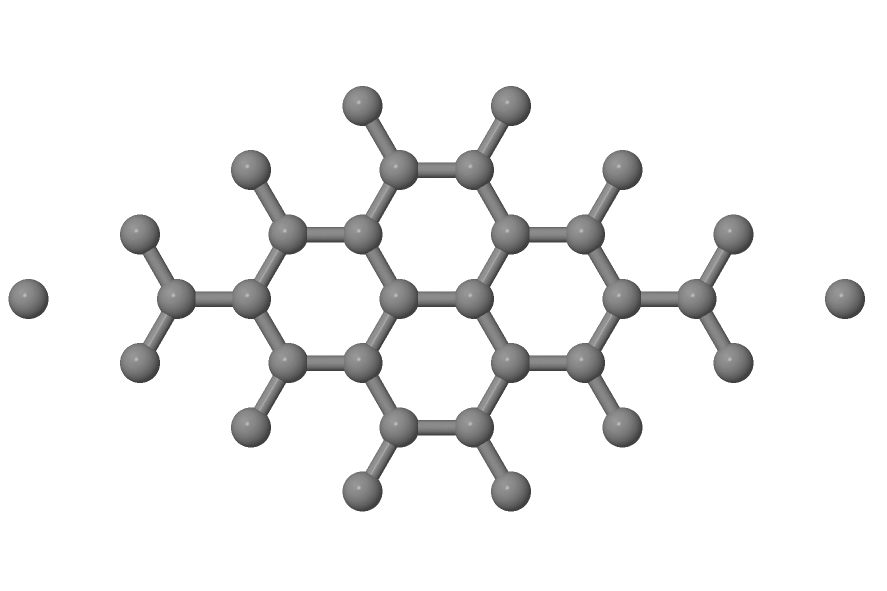

   4x4x1 graphene supercell

Now open the DFTB+ control file `dftb_in.hsd`. You should see the following
options within it:

* First we include the GEN-formatted geometry file, `geo.gen`, using the
  inclusion operator (``<<<``)::

    Geometry = GenFormat {
       <<< "geo.gen"
    }

* Then we specify the ``ConjugateGradient`` driver to optimize the geometry and
  also the lattice vectors. Since neither the angle between the lattice vectors
  nor their relative lengths should change during optimization, we carry out an
  isotropic lattice optimization::

    Driver = ConjugateGradient {
      LatticeOpt = Yes
      Isotropic = Yes
    }

* Then the details of the DFTB hamiltonian follow::

    Hamiltonian = DFTB {

* Within this block, we first specify the location of the parametrization files
  (the Slater-Koster files) and provide additional information about the highest
  angular momentum for each element (this information is not yet stored in the
  Slater-Koster-files)::

    MaxAngularMomentum {
      C = "p"
    }
    SlaterKosterFiles = Type2FileNames {
      Prefix = "../../slako/"
      Separator = "-"
      Suffix = ".skf"
    }

  Please note, that the highest angular momentum is **not a free parameter** to
  be changed, but it must correspond to the value given in the documentation
  section of the correspoding homonuclear Slater-Koster-files (e.g. see the
  `C-C.skf` file for carbon).

* We use the self-consistent charge approach (SCC-DFTB), enabling charge
  transfer between the atoms::

     SCC = Yes

* As graphene is metallic we smear the filling function to achieve better
  SCC-convergence::

    Filling = Fermi {
      Temperature [Kelvin] = 100
    }

* For the Brillouin-zone sampling we set our k-points according to the 48 x 48 x
  1 Monkhorst-Pack sampling scheme. This contains those k-points which would be
  folded onto the k-point (0.5, 0.5, 0.0) of an enlarged supercell consisting of
  the primitive unit cell repeated by (48, 0, 0), (0, 48, 0) and (0, 0, 1). This
  can be easily specified with the ``SupercellFolding`` option, where one
  defines those supercell vectors followed by the target k-point. ::

    KPointsAndWeights = SuperCellFolding {
      48 0 0
      0 48 0
      0 0 1
      0.5 0.5 0.0
    }

* We also want to do some additional analysis by evaluating the contributions of
  the s- and p-shells to the density of states (DOS). Accordingly, we
  instruct DFTB+ in the ``Analysis`` block to calculate the contribution of all
  C atoms to the DOS in a shell-wise manner (s and p) and store the
  shell-contributions in files starting with a prefix of `pdos.C`::

    Analysis {
      ProjectStates {
        Region {
          Atoms = C
          ShellResolved = Yes
          Label = "pdos.C"
        }
      }
    }

Running the code
^^^^^^^^^^^^^^^^

When you run DFTB+, you should always save its output into a file for later
inspection. We suggest using a construction like this (output is saved into the
file `output`)::

  dftb+ | tee output

You will see that DFTB+ optimizes the geometry of graphene by changing the
lattice vectors and ion coordinates to locally minimise the total energy. As the
starting geometry is quite close to the optimum one, the calculation should
finish almost immediately.

Apart from the saved output file (`output`), you will find several other new
files created by the code:

`dftb_pin.hsd`
  Contains the parsed user input with all the default settings for options which
  have not been explicitely set by the user. You should have look at it if you
  are unsure whether the defaults DFTB+ used for your calculation are
  appropriate, or if you want to know which other options you can use to adjust
  your calculation.

`detailed.out`
  Contains detailed information about the calculated physical quantities
  (energies, forces, charges, etc.) obtained in the last SCC cycle performed.

`band.out`
  Eigenvalues (in eV) and fillings for each k-point and spin channel.

`charges.bin`
  Charges of the atoms at the last iteration, stored in binary format. You can
  use this file to restart a calculation with those atomic charges.

`geo_end.xyz`, `geo_end.gen`
  Final geometry in both XYZ and GEN formats.

`pdos.C.1.out`, `pdos.C.2.out`
  Output files containing the projected density of states for the first and
  second angular shells of carbon (in this case the 2s and 2p shells). Their
  format is similar to `band.out`.

Analysing results
^^^^^^^^^^^^^^^^^

The very first thing you should check is whether your calculation has converged
at all to a relaxed geometry. The last line of the `output` file contains the
appropriate message::

  Geometry converged

This means that the program stopped because the forces on the atoms which are
allowed to move (all of them in this example) were less than a given tolerance
(specified in the option ``MaxForceComponent``, which defaults to 1e-4 atomic
units) and not instead because the maximal number of geometry optimization steps
have been executed (option ``MaxSteps``, default 200).

You should visualize the resulting structure using Jmol (or any other molecular
visualization tool). You should probably repeat the geometry again to get a
better idea how it looks like, as we did for the starting structure above. The
distance between the C atoms should be very similar to those in the initial
structure.

In order to visualize the density of states and the partial density of states,
you should convert the corresponding human readable files (with prefix `.out`)
to XY-format data ::

  dp_dos band.out dos.dat
  dp_dos -w pdos.C.1.out pdos.C.1.dat
  dp_dos -w pdos.C.2.out pdos.C.2.dat

Please note the flag ``-w``, which is mandatory when converting *partial*
density of states data for plotting. You can obtain more information about
various flags for `dp_dos` by issuing::

  dp_dos -h

You can visualize the DOS and the PDOS for the s- and p-shells of carbon in
one picture using the `plotxy` tool, which is a simple command line wrapper
around the matplotlib python library (issue the command ``plotxy -h`` for
help)::

  plotxy --xlabel "Energy [eV]" --ylabel "DOS" dos.dat pdos.C.1.dat pdos.C.2.dat &

You can use also any other program (gnuplot, xmgrace) which can visualize
XY-data. You should see something similar to 
:numref:`fig_defect_carbon2d-elec_graphene-dos`.

.. _fig_defect_carbon2d-elec_graphene-dos:
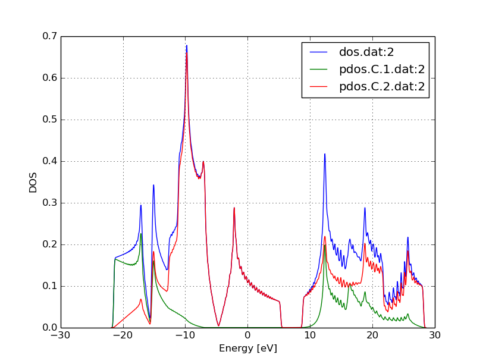

   DOS and PDOS of graphene

The position of the Fermi level (at -4.67 eV) can be read out from the
`detailed.out` file, either directly or by using an appropriate `grep` command::

  grep "Fermi level" detailed.out

As expected for graphene, the DOS vanishes at the Fermi level. Around the
Fermi level, all states are composed of the p-orbitals of the carbons, the
s-orbitals only contribute to energeticaly much lower and much higher
states. Also, one can observe the van-Hove-singularties. The ``wiggles`` at
around 0 eV and at higher energy are artifacts. Using more k-points for the
Brillouin-zone sampling or using a slightly wider broadening function in
`dp_dos` would smooth them out.

Band structure
--------------

[Input: `recipes/defect/carbon2d-elect/graphene/bands/`]

Band structure calculations in DFTB (as in DFT) always consist of two steps:

1. Calculating an accurate ground state charge density by using a high quality
   k-point sampling.

2. Determining the eigenvalues at the desired k-points of the band structure,
   using the density obtained in the previous step. The density is not changed
   during this step of the band structure calculation.

Step 1 you just have executed, so you can copy the final geometry and the data
file containing the converged charges from that calculation into your current
working directory::

  cp ../latopt/geo_end.gen .
  cp ../latopt/charge.bin .

Have a look on the `dftb_in.hsd` file for the band structure calculation. It
differs from the previous one only in a few aspects:

* We use the end geometry of the previous calculation as geometry::

    Geometry = GenFormat {
      <<< "geo_end.gen"
    }

* We need static calculation only (no atoms should be moved), therefore, no
  driver block has been specified.

* The k-points are specified along specific high symmetry lines of the
  Brillouin-zone (K-Gamma-M-K)::

    KPointsAndWeights = KLines {
      1    0.33333333  0.66666666 0.0    # K
     20    0.0  0.0  0.0                 # Gamma
     20    0.5  0.0  0.0                 # M
     10    0.33333333  0.66666666 0.0    # K
    }

* We initialize the calculation with the charges stored during the previous
  run::

    ReadInitialCharges = Yes

* We do not want to change the charges during the calculation, therefore, we set
  the maximum number of SCC cycles to one::

    MaxSCCIterations = 1

Let's run the code and convert the band structure output to XY-format::

  dftb+ | tee output
  dp_bands band.out band

The dp_bands tool extracts the band structure from the file `band.out` and
stores it in the file `band_tot.dat`. For spin polarized systems, the name of
the output file would be different. Use::

  dp_bands -h

to get help information about the arguments and the possible options for
dp_bands.

In order to investigate the band structure we first look up the position of the
Fermi level in the previous calculation performed with the accurate k-sampling
::

  grep "Fermi level" ../latopt/detailed.out

which yields -4.67 eV, and then visualize the band structure by invoking ::

  plotxy -L --xlabel "K points" --ylabel "Energy [eV]" band_tot.dat &

This results in the band structure as shown in 
:numref:`fig_defect_carbon2d-elec_graphene-band`.

.. _fig_defect_carbon2d-elec_graphene-band:
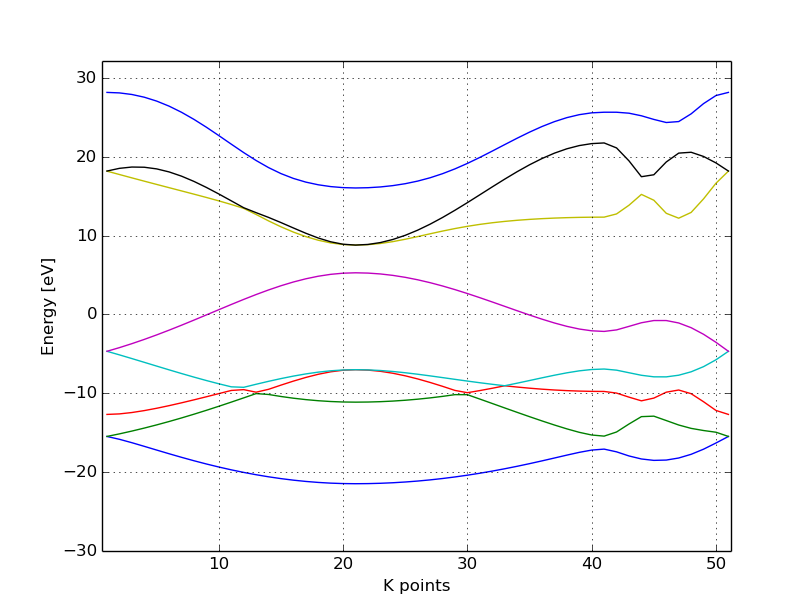

   Band structure of graphene

You can see the linear dispersion relations around the point *K* in the
Brillouin-zone (k-points 0 and 51 in our circuit) which is a very typical
characteristic of graphene.

Zigzag nanoribbon
=================

Next we will study some properties of a hydrogen saturated carbon zigzag
nanoribbon.

Calculting the density and DOS
------------------------------

[Input: `recipes/defect/carbon2d-elect/zigzag/density/`]

The initial geometry for the zigzag nanoribbon contains one chain of the
structure, repeated periodically along the z-direction. The lattice vectors
orthogonal to the periodicity (along the x- and y- axis) are set to be long
enough to avoid any interaction between the repeated images.

First convert the GEN-file to XYZ-format and visualize it::

  gen2xyz geo.gen
  jmol geo.xyz &

Similar to the case of perfect graphene, you should check first the initial
geometry by repeating it along the periodic axis (the third lattice vector in
this example) and visualize it. The necessary steps are collected in the file
`checkgeo.sh`. Please have a look at its content to understand what will happen,
and then issue ::

  ./checkgeo.sh

to obtain the molecule shown in 
:numref:`fig_defect_carbon2d-elec_zigzag-geo-114`.

.. _fig_defect_carbon2d-elec_zigzag-geo-114:
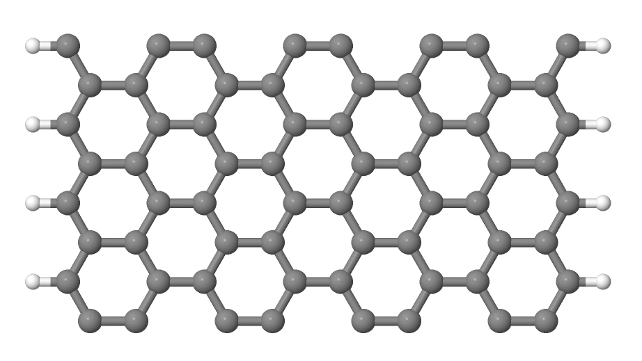

   Section of an H-saturated zigzag nanoribbon

The control file `dftb_in.hsd` is similar to the previous examples, with a few
differences only:

* We use the 1 x 1 x 24 Monkhorst-Pack k-point set to sample the Brillouin-zone,
  since the ribbon is only periodic along the direction of the third lattice
  vector. The two other lattice vectors have been choosen to be long enough to
  avoid interaction between the artificially repeated ribbons.::

    KPointsAndWeights = SupercellFolding {
      1 0 0
      0 1 0
      0 0 24
      0.0 0.0 0.5
    }

* In order to analyze, which atoms contribute to the states around the
  Fermi level, we create four projection regions containing the saturating
  H atoms, the C atoms in the outermost layer of the ribbon, the C atoms in the
  second outermost layer and finally the C atoms in the third outermost layer,
  respectively. Since the ribbon is mirror symmetric, we include the
  corresponding atoms on both sides in each projection region::

    ProjectStates {

      # The terminating H atoms on the ribbon edges
      Region {
        Atoms = H
        Label = "pdos.H"
      }

      # The surface C atoms
      Region {
        Atoms  = 2 17
        Label = "pdos.C1"
      }

      # The next row of C atoms further inside
      Region {
        Atoms = 3 16
        Label = "pdos.C2"
      }

      # Some more 'bulk-like' C atoms even deeper
      Region {
        Atoms = 4 15
        Label = "pdos.C3"
      }
    }

You can run the program and convert the output files by issuing::

  ./run.sh

When the program has finished, look up the Fermi level and visualize the DOS and
PDOS contributions. The necessary commands are collected in `showdos.sh`::

  ./showdos.sh

When you zoom into the area around the Fermi level (-4.57 eV), you should obtain
something like :numref:`fig_defect_carbon2d-elec_zigzag-dos`.

.. _fig_defect_carbon2d-elec_zigzag-dos:
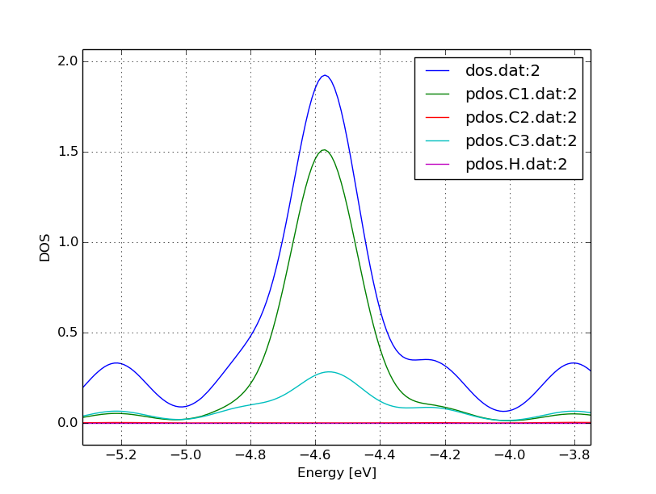

   DOS of the zigzag nanoribbon around the Fermi energy

You can see that the structure is clearly metallic (displaying a non-zero
density of states at the Fermi energy). The states around the Fermi level are
composed of the orbitals of the C atoms in the outermost and the third outermost
layer of the ribbon. There is no contribution from the C atom in the layer in
between or from the H atoms to the Fermi level.

Band structure
--------------

[Input: `recipes/defect/carbon2d-elect/zigzag/bands/`]

Now let's calculate the band structure of the zigzag nanoribbon. The commands
are in the script `run.sh`, so just issue::

  ./run.sh

You will see DFTB+ finishing with an error message ::

  ERROR!
  -> SCC is NOT converged, maximal SCC iterations exceeded

Normally, it would mean that DFTB+ did not manage to find a self consistent
charge distribution for its last geometry. In our case, however, it is not an
error, but the desired behaviour. We have specified in `dftb_in.hsd` the options
::

  ReadInitialCharges = Yes
  MaxSCCIterations = 1

requiring the program to stop after one SCC iteration. The charges are at this
point not self consistent with respect to the k-point set used for sampling the
band structure calculation. However, k-points along high symmetry lines of the
Brillouin-zone, as used to obtain the band structures, usually represent a poor
sampling. Therefore a converged density obtained with an accurate k-sampling
should be used to obtain the eigenlevels, and no self consistency is needed.

To look up the Fermi level and plot the band structure use the commands in
`showbands.sh`::

  ./showbands.sh

You should obtain a band structure similar to 
:numref:`fig_defect_carbon2d-elec_zigzag-band`.

.. _fig_defect_carbon2d-elec_zigzag-band:
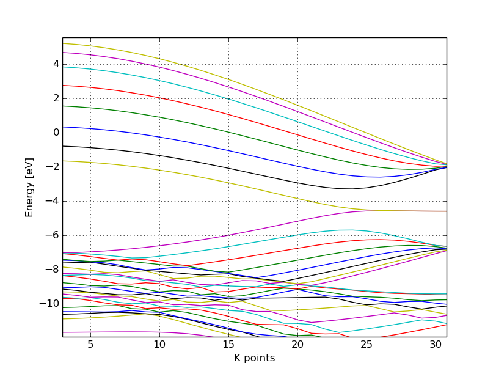

   Band structure of the zigzag nanoribbon

Again, one can see, that there are states around the Fermi-energy, so the
nanoribbon is metallic.

Perfect armchair nanoribbon
===========================

We now investigate a hydrogen saturated armchair carbon nanoribbon, examining
both the perfect ribbon and two defective structures, each with a vacancy at a
different position in the ribbon. In order to keep the tutorial short, we will
not relax the vacancies, but will only remove one atom from the perfect
structure.

Total energy and density of state
---------------------------------

[Input: `recipes/defect/carbon2d-elect/armchair/perfect_density/`]

The steps to calculate the DOS of the perfect H-saturated armchair nanoribbon
are the same as for the zigzag case. First check the geometry with the help of
repeated supercells::

  ./checkgeo.sh

You will see a repeated image of the perfect armchair nanoribbon unit cell
(:numref:`fig_defect_carbon2d-elec_armchair-perfect-geo`).

.. _fig_defect_carbon2d-elec_armchair-perfect-geo:
.. figure:: ../_figures/defect/carbon2d-elec/armchair-perfect-geo.png
   :width: 70%
   :align: center
   :alt: Perfect armchair nanoribbon geometry.

   Perfect armchair nanoribbon unit cell

The edge of the ribbon is visually different from the zigzag case. As it turns
out, this also has some physical consequences. Let's calculate the electronic
density and extract the density of states::

  ./run.sh

If you look up the calculated Fermi level and then visualize the DOS ::

  ./showdos.sh

you can immediately see (
:numref:`fig_defect_carbon2d-elec_armchair-perfect-dos`) that there are no
states around the Fermi-energy (-4.4 eV), i.e. the investigated armchair
nanoribbon is non-metallic.

.. _fig_defect_carbon2d-elec_armchair-perfect-dos:
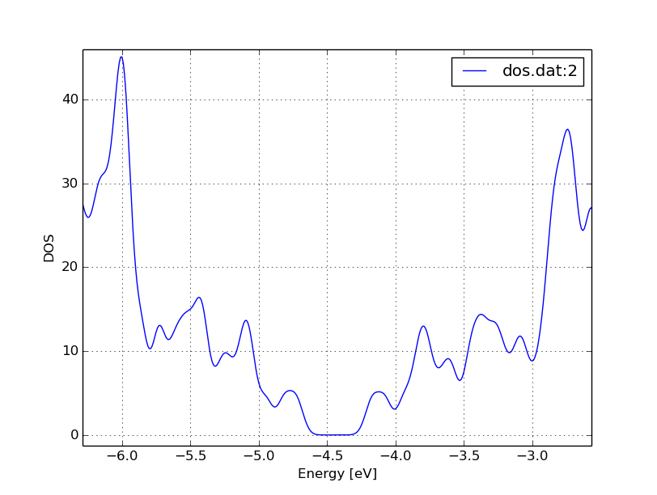

   DOS of the perfect armchair nanoribbon

Band structure
--------------

[Input: `recipes/defect/carbon2d-elect/armchair/perfect_bands/`]

Let's have a quick look at the band structure of the armchair H-saturated
ribbon. The steps are the same as for the zigzag case, so just issue::

  ./run.sh
  ./showbands.sh

You should obtain a band structure like in 
:numref:`fig_defect_carbon2d-elec_armchair-perfect-band`. You can read off the
position of the band edges, when you zoom into the energy region around the gap:
The valence band edge and the conduction band edge are in the Gamma point at
-4.7 and -4.2 eV, respectively. You can also easily extract this information
from the `band.out` file, where the occupation goes from nearly 2.0 to nearly
0.0 in the first k-point (the Gamma point).

.. _fig_defect_carbon2d-elec_armchair-perfect-band:
.. figure:: ../_figures/defect/carbon2d-elec/armchair-perfect-band.png
   :width: 70%
   :align: center
   :alt: Band structure of perfect armchair nanoribbon.

   The band structure of the perfect hydrogen passivated armchair
   nanoribbon. The Fermi energy is at -4.4 eV.

.. _defect-electronic-states:

Armchair nanoribbon with vacancy
================================

Density and DOS
---------------

[Input: `recipes/defect/carbon2d-elect/armchair/vacancy1_density/`,
`recipes/defect/carbon2d-elect/armchair/vacancy21_density/`]

As next, we should investigate two armchair nanoribbons with a vacancy in
each. The inputs can be found in the corresponding directories and you can
visualize both with the command ::

  ./showgeom_v12.sh

As you can see on :numref:`fig_defect_carbon2d-elec_armchair-v1-geo` and
:numref:`fig_defect_carbon2d-elec_armchair-v2-geo`, the vacancy is in the two
cases on different sublattices.

.. _fig_defect_carbon2d-elec_armchair-v1-geo:
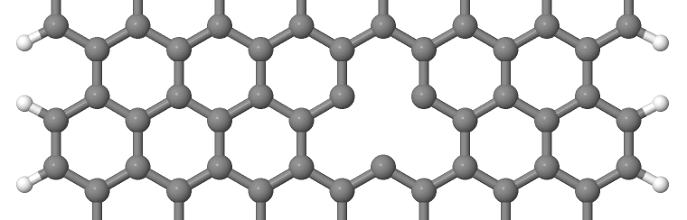

   Armchair nanoribbon with vacancy (structure 1)

.. _fig_defect_carbon2d-elec_armchair-v2-geo:
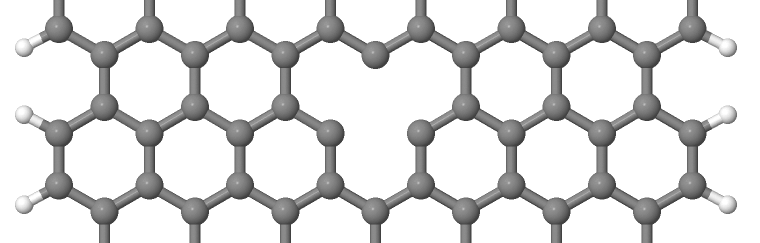

   Armchair nanoribbon with vacancy (structure 2)

The two vacancies (structures 1 and 2) are located on different
sublattices. Since the geometries are periodic along the z-direction, the
defects are also repeated. As we would like to calculate a single vacancy, we
have to make our unit cell for the defect calculation large enough to avoid
significant defect-defect interactions. In this case, the defective cells
contain twelve unit cells.

In order to calculate the electron density of both vacancies, issue::

  ./run_v12.sh

This will take slightly longer than the previous calculations, since each system
contains more than four hundred atoms.

We want to analyse the density of states of the two different vacancies,
together with that of the defect-free system. The commands necessary to extract
the DOS of all three configurations and show them in one figure have been stored
in the script ``showdos_perf_v12.sh``. Execute it ::

  ./showdos_perf_v12.sh

to obtain a figure like :numref:`fig_defect_carbon2d-elec_armchair-dos`.

.. _fig_defect_carbon2d-elec_armchair-dos:
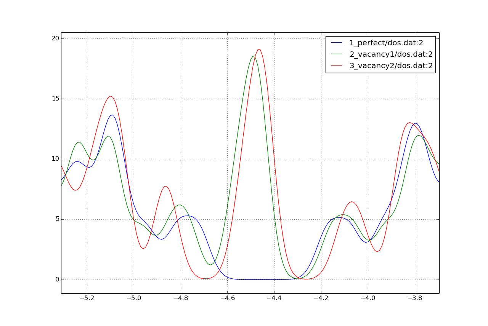

   The DOS of the perfect nanoribbon is indicated by solid blue line, the DOS
   of the nanoribbons with vacancies with green and red lines, respectively.

As you can see, in contrast to the zigzag nanoribbon, the perfect armchair
nanoribbon is insulating as it has no states around the Fermi-energy (-4.45 eV).
The structures with vacancies, on the other hand, introduce dangling
(unsaturated) bonds, leading to unoccupied states around the Fermi-energy. We
can also see, that the defects affect the band edges, which are shifted with
respect to their position in the perfect structure. It also seems that the
valence band edge is more affected than the conduction band edge, and in the
case of vacancy 2 (red line) the effect is significantly larger than for vacancy
1 (green line).

Vacancy formation energy
------------------------

You should also be able to calculate the formation energies of the two
vacancies. The formation energy :math:`E_{\text{form}}` of the vacancy in our
case can be calculated as

.. math::
   E_{\text{form}} = \left( E_{\text{vac}} + E_{\text{C}} \right)
   - 12 \times E_{\text{perf}}

where :math:`E_{\text{vac}}` is the total energy of the nanoribbon with the
vacancy present, :math:`E_{\text{C}}` is the energy of a C atom in its standard
phase and :math:`E_{\text{perf}}` is the energy of the perfect nanoribbon. Since
the defective nanoribbons contain 12 unit cells of the perfect one, the energy of
the perfect ribbon unit cell has to be multiplied by twelve. As a standard phase
of carbon, we will take perfect graphene for simplicity. The energy of the
C atom in its standard phase is then obtained by dividing the total energy of
the perfect graphene primitive unit cell by two. (Look up this energy from
`detailed.out` in the directory `elect/graphene/density`.)  By calculating the
appropriate quantities you should obtain ~8.5 eV for the formation energy of
both vacancies. This is quite a high value, but you should recall that the
vacancies have not been structurally optimised, and their formation energies are
therefore, significantly higher than for the relaxed configurations.

Defect levels
-------------

[Input: `recipes/defect/carbon2d-elect/armchair/vacancy2_wf/`]

Finally we should identify the localised defect levels for vacancy 2 and plot
the corresponding one-electron wavefunctions.

The vacancy was created by removing one C atom, which had three first neighbors.
Therefore, three :math:`\text{sp}^2` type dangling bonds remain in the lattice,
which will then form some linear combinations to produce three defect levels,
which may or may not be in the band gap. The DOS you have plotted before,
indicates there are indeed defect levels in the gap, but due to the smearing it
is hard to say how many they are.

We want to investigate the defect levels at the Gamma point, as this is where
the perfect nanoribbon has its band edges. We will therefore do a quick
Gamma-point only calculation for vacancy structure 2 using the density we
obtained before. We will set up the input to write out also the eigenvectors
(and some additional information) so that we can plot the defect levels with
`waveplot` later. This needs the following additional settings in
`dftb_in.hsd`::

  Options {
    WriteEigenvectors = Yes
    WriteDetailedXML = Yes
    WriteDetailedOut = No
  }

To just run the calculation ::

  ./run.sh

and open the `band.out` file. You will see, that you have three levels (levels
742, 743 and 744 at energies of -4.51, -4.45 and -4.45 eV, respectively) which
are between the energies of the band edge states of the perfect ribbon. We will
visualize those three levels by using the `waveplot` tool.

Waveplot reads the eigenvectors produced by DFTB+ and plots real space
wavefunctions and densities. The input file `waveplot_in.hsd` can be used to
control which levels and which region waveplot should visualize, and on what
kind of grid. In the current example, we will project the real part of the
wavefunctions for the levels 742, 743 and 744. In order to run Waveplot, enter::

  waveplot | tee output.waveplot

The calculation could again take a few minutes. At the end, you should see three
files with the `.cube` prefix, containing the volumetric information for the
three selected one-electron wavefunctions.

We will use Jmol to visualize the various wavefunction
components. Unfortunately, the visualization of iso-surfaces in Jmol needs some
scripting. You can find the necessary commands in the files `show*.js`. You can
either type in these commands in the Jmol console (which should be opened via
the menu `File | Console...`) or pass it to Jmol using the `-s` option at
start-up. For the case latter you will find prepared commands to visualize the
various orbitals in the files ::

  ./showdeflev1.sh
  ./showdeflev2.sh
  ./showdeflev3.sh

Looking at the defect levels, you can see that the defect level lowest in
energy (742) has a significant contribution on the atoms around the defect, but
also a non-negligible delocalized part smeared over almost all atoms in the
system. Apparently a localized defect level has hybridized with the delocalized
valence band edge state, resulting in a mixture between localized and
non-localized state. The other two defect levels, on the other hand, have
wavefunctions which are well localized on the atoms around the vacancy
site. Note that in accordance with the overall symmetry of the system, the
defect levels are either symmetric or antisymmetric with respect to the mirror
plane in the middle of the ribbon.

.. _fig_defect_carbon2d-elec_armchair-v2-def1:
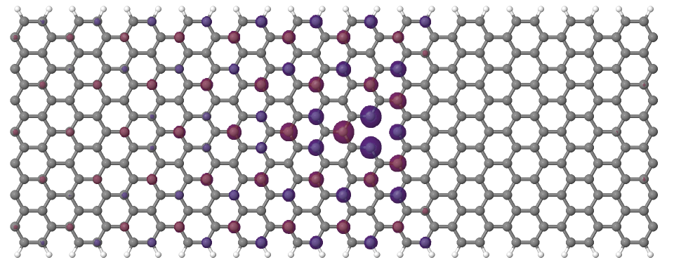

   Wavefunction of the lowest defect level of the hydrogen saturated armchair
   nanoribbon with a vacancy. Blue and red surfaces indicate isosurfaces
   at +0.02 and -0.02 atomic units, respectively.

.. _fig_defect_carbon2d-elec_armchair-v2-def2:
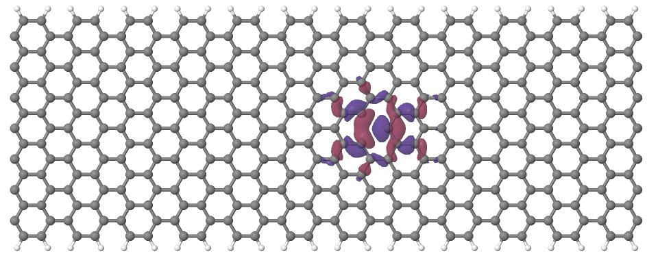

   Wavefunction of the second lowest defect level of the hydrogen saturated
   armchair nanoribbon with a vacancy. Blue and red surfaces indicate
   isosurfaces at +0.02 and -0.02 atomic units, respectively.

.. _fig_defect_carbon2d-elec_armchair-v2-def3:
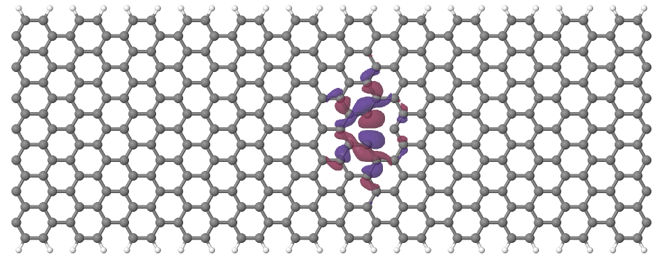

   Wavefunction of the highest defect level of the hydrogen saturated
   armchair nanoribbon with a vacancy. Blue and red surfaces indicate
   isosurfaces at +0.02 and -0.02 atomic units, respectively.
