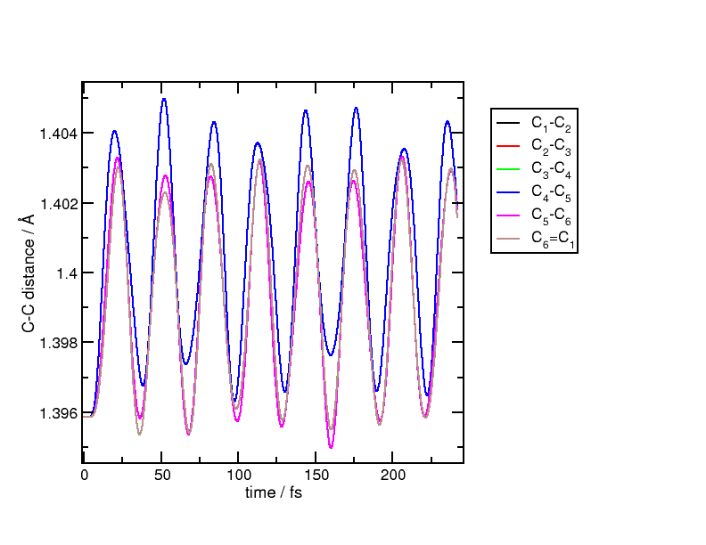

.. highlight:: none

******************
Ehrenfest dynamics
******************

As explained above (in the introduction to the :ref:`sec-electrondynamics`
chapter) electron-nuclear dynamics within the Ehrenfest *ansatz* are based on
the integration of the ionic equations of motion using the expectation value of
the force that corresponds to the current density matrix. Nuclear dynamics drive
electronic dynamics in turn through the time-dependent nuclear positions that
appear in the Hamiltonian. The nuclear and electronic systems interact through
*expectation values* and therefore Ehrenfest is a *mean-field* approximation to
the actual coupled electron-ion dynamics. This approximation is useful in some
situations; however, the neglected electron-ion correlations might be essential
for some processes. The crossing of conical intersections, for example, is where
the approximation breaks down drastically.

Benzene example
===============

[Input: `recipes/electronicdynamics/ehrenfest/`]

As an example of Ehrenfest dynamics, starting from the equilibrium geometry we
can excite the lowest-lying :math:`\pi-\pi^*` excitation of a benzene molecule
using a short laser pulse, and explicitly allow the ions to move. In this case,
the ``ElectronDynamics`` blocks is as follows:

.. literalinclude:: ../_archives/recipes/electronicdynamics/ehrenfest/dftb_in.hsd
   :lines: 24-38

The keyword ``IonDynamics`` is set to ``Yes`` and for this example, we are
starting with zero initial atomic velocities. The short, but strong, laser pulse
drives electrons from the HOMO to the LUMO and this sudden change in the
electronic structure impulsively drives the nuclei to move. In the following
figure, we plot the distances between neighbouring carbon atoms in the benzene
ring:

          pulse.

After the short excitation, all carbon atoms move in a *breathing* motion with
all distances increasing and decreasing periodically. The breathing is not
perfect but is a good approximation of the actual motion. The process can be
explained if we picture the state of the system being in a coherent
superposition between the ground and excited states. In this superposition,
electrons which were occupying bonding orbitals now partially populate
anti-bonding orbitals. In this highly symmetric molecule, all C-C bonds lose
strength and therefore, after the excitation, the equilibrium position is
displaced to a longer inter-atomic distance. This sudden change of effective
potential energy surface drives the nuclear motion, which now oscillates around
the new displaced equilibrium.
