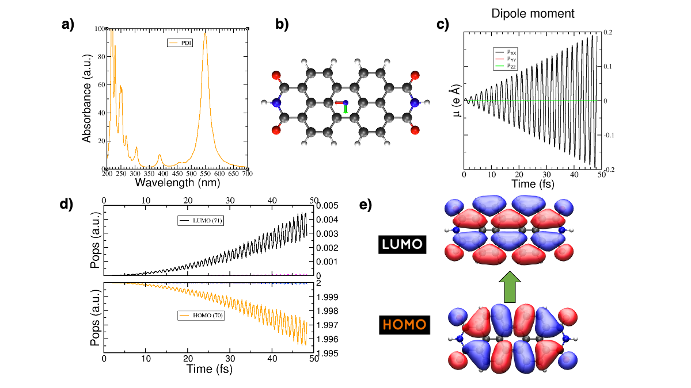

.. highlight:: none

*******************************************************************
Tutorial: Photoinduced charge transfer in a donor-acceptor complex.
*******************************************************************

This is the tutorial given at the DFTB+ School 2022 in Daresbury, UK. The idea is to get familiar
with the real-time TDDFTB method applied to molecules and molecular complexes, learning the basics of absorption spectra calculations and photoinduced processes such as charge transfer under laser irradiation.
The tutorial is based on the following work: **Photoinduced charge-transfer dynamics simulations in noncovalently bonded molecular aggregates.
** Medrano, C. R., Oviedo, M. B., & Sánchez, C. G. (2016). Physical Chemistry Chemical Physics, 18(22), 14840–14849. `https://doi.org/10.1039/c6cp00231e <https://doi.org/10.1039/c6cp00231e>`_

Spectra and analysis
====================

We will first calculate the absorption spectra of two different molecules and
analyse them using the tools provided by DFTB+.

Calculation of the absorption spectrum of carbazole
---------------------------------------------------

[Input: `recipes/electronicdynamics/tutorial/01_spectra_and_laser/01_carbazole/01_spectrum`]

We will calculate the absorption spectrum of the carbazole molecule, following the procedure described in  :ref:`sec-spectra`.

1. Take a look at the input coordinates *coords.gen*. The *.gen* format
   is the one used for DFTB+ code (see section :ref:`gen_format` for more details). In order to visualize the molecule,
   you can use the ``gen2xyz`` script, provided in the installation of the 
   DFTB+ code, by running::
     
     gen2xyz coords.gen

   This will generate a *coords.xyz* that you can open with VMD, Avogadro or
   any other molecular visualization software of your choice. An image of the
   carbazole molecule made with VMD is presented in :numref:`fig_carbazole`.

   .. _fig_carbazole:
   .. figure:: ../_figures/elecdynamics/tutorial/carbazole.png
      :height: 30ex
      :align: center
      :alt: Carbazole molecule.

      Carbazole molecule

2. Open the *dftb_in.hsd_spec* file. This is a template for the calculation
   of the absorption spectrum.

   - Take a look at the ``ElectronDynamics`` block at the end of the file:: 
    
      ElectronDynamics = {
          Steps =                         # defines the total simulation time
          TimeStep [au] =                 # resolution of the spectrum
          Perturbation = Kick {           # external field is a kick (Dirac delta)
              PolarizationDirection =     # desired direction/s
          }
          FieldStrength [v/a] =           # field strength of the kick
      }

   - The input variables to be considered for the calculation of the spectrum are four:

     * ``Steps`` (integer): the number of steps of the dynamics. The longer the dynamics, the lower the
       energies that can be resolved in the spectrum (the total time is also afected by the ``TimeStep``, of course). Here, we will use 10000 steps.
     * ``TimeStep`` (float): the time step in time units. Here we use 0.2 a.u (0.0048 fs), which is normally stable for simulations of a few tens of thousands of steps. In case there is instability in the dynamics, the time step shuld be decreased.
     * ``Perturbation``: In this case we need a Dirac-delta perturbation (AKA kick) and we need to 
       specify the ``PolarizationDirection`` that could be *X*, *Y*, *Z* (if we are interested in 
       one particular direction) or ``all`` if we want to calculate the three kicks consequtively and then calculate the spherically-averaged spectrum, accounting for random molecular orientations.
       Hence, we set it as ``all``.
     * ``FieldStrength`` (float): the field strength of the perturbation applied. For the
       calculation of the absorption spectrum, it must be within the linear response regime,
       i.e. usually 0.001 :math:`V/\AA` or lower.

   - Complete the template file, copy it to *dftb_in.hsd* and run the calculation.

3. Once the dynamics ends, we will have calculated the time-resolved dipole moment using 3 field polarization directions (*mux.dat*, muy.dat, *muz.dat*). We need to average and Fourier-transform (or the other way around, as these are linear operations) these dipole components
   in order to obtain the absorption spectrum of the molecule. To do this, we will use the
   ``calc_timeprop_spectrum`` tool available after installation of DFTB+ under: 
   *dftbplus/tools/misc/*. In the folder
   where you have the dipole files just type::

    calc_timeprop_spectrum -d 4 -f 0.001

   where the option -d is for the damping constant (artificial lifetime, in fs), which is equivalent to convoluting each resonance with a Lorentzian in time domain.
   The option -f is the field strength of the kick (in :math:`V/\AA`).  applied during dynamics.

4. After running the script you will find two new files: *spec-nm.dat* and *spec-ev.dat* which are
   the absorption spectra in nm and eV, respectively. Plot the spectrum file with the plotting tool
   of your choice and look at the lowest energy transitions. You should then see
   an absorption spectrum similar to :numref:`fig_carbazole_spec`.

   .. _fig_carbazole_spec:
   .. figure:: ../_figures/elecdynamics/tutorial/spec-nm-carbazole.png
      :width: 60%
      :align: center
      :alt: Absorption spectrum of carbazole molecule

      Absorption spectrum of carbazole molecule

5. Change the damping constant for a higher value, recalculate the specctrum and plot both spectra
   together. What is the effect of the damping time in the spectrum?
   In :numref:`fig_carbazole_spec_damp` can be seen the same spectrum calculated with
   different values of the damping constant.

   .. _fig_carbazole_spec_damp:
   .. figure:: ../_figures/elecdynamics/tutorial/specs-comparison-damp.png
      :width: 60%
      :align: center
      :alt: Influence of the damping constant value ``d`` in the absorption spectrum.

      Influence of the damping constant value ``d`` in the absorption spectrum.

Analysis of the absorption spectrum of carbazole: driving the system with a laser
---------------------------------------------------------------------------------

[Input: `recipes/electronicdynamics/tutorial/01_spectra_and_laser/01_carbazole/02_laser`]

We will consider a laser perturbation in tune with the lowest energy
transition of the molecule in order to study the photodynamic
process of absorption in this transition. In order to do this, we
will follow the same procedure as described in :ref:`sec-driving`, 
finding first the lowest energy transition of the molecule in the spectrum plotted in the previous calculation, and then calculating the direction of maximal polarization of the transition.

1. Open the *dftb_in.hsd_laser* file. This is a template for the calculation
   of a laser perturbation.

   - Take a look at the ``ElectronDynamics`` block at the end of the file:: 
     
      ElectronDynamics = {
         Steps = 10000
         TimeStep [au] = 0.2
         Perturbation = Laser{              # laser type perturbation
            LaserEnergy [nm] =              # energy or wavelength of interest
            PolarizationDirection =         # to be calculated with calc_timeprop_maxpoldir
         }
         FieldStrength [v/a] = 0.001
         Populations = Yes                  # to write GS-MP projected populations during the dynamics
      }

     Now, the ``Perturbation`` type is a continuous-wave ``laser``, for which we need to specify two parameters:
         
         * ``LaserEnergy`` (float): the energy of the applied laser that may be
           the transition energy of interest. This value must be in energy units
           like eV but also a wavelength in nm is allowed.
         * ``PolarizationDirection`` (vector): in the case of a laser, the 
           ``PolarizationDirection`` is a 3-components vector.

     Note that we turned on the ``Populations`` flag in order to write
     the occupations during the dynamics. Also note that we are asking for
     the detailed xml and the eigenvectors with the ``WriteDetailedXML``
     and ``WriteEigenvectors`` options. We will need them to plot the orbitals
     with waveplot in the following sections. 

2. To complete the input template for the laser, we need to provide
   the ``LaserEnergy`` and the ``PolarizationDirection`` of the laser. Based on 
   our previous calculated spectrum, calculate the direction of maximal 
   polarization of the lowest energy transition of the molecule.

   - Help: use the tool ``calc_timeprop_maxpoldir`` already available in
     your installation (under: *dftbplus/tools/misc/*). To know how this
     tool work the user can just type::

      calc_timeprop_maxpoldir -h

   - Along which axis/axes is the polarization of the molecule oriented? Why?
  
     - Hint: try to visualize the molecule and see how it is oriented with respect
       to the cartesian axes.
   
   + Solution: If you choose the lower energy transition of carbazole you may do::
      
      calc_timeprop_maxpoldir -10 -w 326

     and you will obtain the following transition dipole vector::
      
      PolarizationDirection = 0.99999 0.00101 -0.003815

     which is essentially paralel to the *X* cartesian direction (because
     of the molecules orientation with respect to the cartesian axes)

3. Prepare the input for the dynamics under a continuous laser perturbation.
   Use the energy obtained from the spectrum as the ``LaserEnergy``
   and the vector obtained above as the ``PolarizationDirection`` of the 
   laser.

   - Why we should use this laser polarization instead of any other?

4. After the dynamics, take a look at the *mu.dat* file. You could plot the 3
   componets of the dipole moment by doing::

      xmgrace -nxy mu.dat

   In :numref:`fig_carbazole_mu` the dipole moment is plotted.

   - Is the dipole moment increasing linearly?
   
   .. _fig_carbazole_mu:
   .. figure:: ../_figures/elecdynamics/tutorial/mu-carbazole-components.png
      :width: 60%
      :align: center
      :alt: mu components

      Dipole moment components vs time for the laser dynamics.

5. Take a look at the *molpopul1.dat* file
   generated. This file contains the populations projected on the GS orbitals during the dynamics::
      
      # GS molecular orbital populations, spin channel : 1
      #time (fs) | population (orb 1) | population (orb 2) | ... | population (orb N) |
      0.237050663997490  1.999999999825206  1.999999999780047  1.999999999771997  ...
      0.478939096647990  1.999999999978780  1.999999999983538  1.999999999962606  ...
      0.720827529298490  1.999999999870651  1.999999999913354  1.999999999904491  ...

   - Which orbitals are involved in the transition?
     Help: you can plot the *molpopul1.dat* file using `xmgrace`::

        xmgrace -nxy molpopul1.dat

     Look at the populations initially at y=2 (occupied orbitals in the GS basis) and find
     which curves are decreasing over time, these are the orbitals
     being depopulated.
     Look at the populations initially at y=0 (unoccopied orbitals in the GS basis) and find
     the orbitals being populated over time.

     You could also check in the *band.out* file generated from the SCC 
     calculation the states numbers. Close to the Fermi energy, you 
     should see something like::

      29    -6.641  2.00000
      30    -5.809  2.00000
      31    -5.512  2.00000    #HOMO
      32    -1.983  0.00000    #LUMO
      33    -1.358  0.00000
      34    -0.501  0.00000

     where it is clear that states 31 and 32 are the HOMO 
     and LUMO of the molecule, respectively.   

6. Let's visualize those orbitals using ``waveplot``. For a complete description please check :ref:`sec-basics-waveplot`.

  - Look at the *waveplot_in.hsd_* template input file for waveplot:
    
    - Which files are needed?
    - In which orbitals are we interested?

  - After editing this file, just rename it to *waveplot_in.hsd* and run
    ``waveplot`` using your current installed executable, which should be in the same installation directory as the `dftbplus` executable.

  - After running waveplot, a number of files would be generated starting with "wp-1-1".

7. Let's plot these orbitals:

   - Open the cube files that correspond to the HOMO and LUMO and plot them as an isosurface.
     For that there are several software options. Particularly, we give here some links for VMD and VESTA:
     For a tutorial on the `Basics of VMD <https://www.ks.uiuc.edu/Training/SumSchool/materials/sources/tutorials/01-vmd-tutorial/html/node2.html>`_ and/or plotting an `isosurface <https://www.ks.uiuc.edu/Research/vmd/current/ug/node77.html>`_ method please refer to these links.
     `VESTA <https://jp-minerals.org/vesta/en/download.html>`_ allows the user to open directly cube files showing the isosurface immediately
     with some default parameters, making it a really good option for quick inspections.

As a reference, we plotted the populations obtained from the laser dynamics
and the orbitals involved in the transition in :numref:`fig_carbazole_pops`.

.. _fig_carbazole_pops:
.. figure:: ../_figures/elecdynamics/tutorial/molpopul-carbazole.png
   :width: 100%
   :align: center
   :alt: molpopul1-carbazole

   (left)Populations vs time for the laser dynamics. (right) Orbitals involved
   in the lower energy transition of the carbazole molecule.

Now it's your turn! Calculation of PDI absorption spectrum
----------------------------------------------------------

[Input: `recipes/electronicdynamics/tutorial/01_spectra_and_laser/02_PDI/``]

We will repeat the procedure used for the carbazole molecule with a new
molecule, PDI.

1. Based on the calculations that you ran before.

  - Calculate the absorption spectrum with a proper *dftb_in.hsd* input file.
  - Find the lowest energy transition.
  - Apply a laser tuned with this transition.
  - Obtain the orbitals involved in the transition using waveplot and plot them.

The reference results are plotted in :numref:`fig_PDI` 

.. _fig_PDI:

   \(a\) Absorption spectrum of the PDI molecule.\(b\) PDI molecule structure.\(c\) Dipole
   moment components vs time during a laser dynamics at 548 nm (note that in 
   this case the dipole moment in the *X* direction increases linearly).\(d\) Populations
   vs time for the laser dynamics.\(e\) Orbitals involved in the transition.

Photoinduced charge transfer
============================

Calculate the absorption spectrum of a donor-acceptor aggregate
-----------------------------------------------------------------

[Input: `recipes/electronicdynamics/tutorial/02_photoinduced_CT/01_aggregate_spec/`]

1. Visualize the coordinates file *coords.xyz*.
   
   .. _fig_aggregate:
   .. figure:: ../_figures/elecdynamics/tutorial/PDI+carbazole.png
      :width: 60%
      :align: center
      :alt: PDI+carbazole aggregate

      PDI+carbazole derivatives aggregate

   It is an aggregate of the two previous molecules, in which the carbazole and
   PDI derivatives act as donor and acceptor of electrons, respectively.

      - Convert the coordinates into *gen* format (using the ``xyz2gen`` script) and
        calculate the absorption spectrum using the *dftb_in.hsd_spec* as a template
        for the input (copy this file or rename it as *dftb_in.hsd*).

2. Compare the calculated spectrum with the individual ones (you can use the spectra
   calculated before or recalculate them from these derivatives). For the comparison to be valid,
   you should use the same damping constant for all spectra. Are there relevant differences?
   See :numref:`fig_specs_AD`.
   
   .. _fig_specs_AD:
   .. figure:: ../_figures/elecdynamics/tutorial/specs-compar-A+D.png
      :width: 60%
      :align: center
      :alt: A+D spectrum

      Absorption spectrum of the PDI+carbazole derivatives aggregate (in black),
      compared to the individual spectrum for the PDI moiety (in orange) and 
      the carbazole moiety (in red).

3. We are interested in the dynamics upon ilumination of the acceptor molecule. For such
   puropose, we will perform a driven simulation in next step and for it, we need to calculate
   the transition dipole direction of the absorption band at ~530 nm. Calculate this vector
   using the ``calc_timeprop_maxpoldir`` tool. You shold obtain something similar to::
      
      PolarizationDirection = -0.99977 0.01777 0.01122

   which is essentially the *X* direction (since the PDI molecule axis is 
   paralel to the *X* axis in the coordinates).

Laser dynamics on the donor-acceptor aggregate and charge transfer
------------------------------------------------------------------

[Input: `recipes/electronicdynamics/tutorial/02_photoinduced_CT/02_aggregate_CT/`]

1. With the transition dipole moment vector calculated previously, prepare
   your input file for a laser-driven electron dynamics in tune with the acceptor (PDI)
   lowest energy excitation. Use the *dftb_in.hsd_pulse* as a template. Note
   that this time we add an envelope function to the laser perturbation in order
   to mimic a laser pulse::
      
      ElectronDynamics = {
         Steps = 20000
         TimeStep [au] = 0.2
         Perturbation = Laser{
            PolarizationDirection =      # to be completed
            LaserEnergy [nm] =           # to be completed
            }
         EnvelopeShape = Sin2{           # envelope shape type
         Time1 [fs] = 30.0               # pulse duration (by default the initial time is Time0 = 0)
         }
         FieldStrength [v/a] = 0.02      # larger field strength than the kick (0.001) to observe driven dynamics clearly
         Populations = Yes
      }
   
   Now in the ElectronDynamics we added the Sin2 ``EnvelopeShape`` with 
   a duration of 30 fs starting at the beginning of the dynamics. We will
   also ask the code to print the populations during dynamics to study the
   mechanism of charge transfer. Complete the input template filling the 
   ``PolarizationDirection`` and ``LaserEnergy`` obtained before and run the 
   code (don't forget to rename the template to *dftb_in.hsd*).

2. After running the electron dynamics, let inspect the *qsvst.dat*
   file::

      #time (fs) | total net charge (e) | charge (atom_1) (e) | ... | charge (atom_N) (e)|
      0.000000000000000   -0.000000000000055   0.075753114169209   0.077680106829215  ...
      0.241888432650500   -0.000000000000048   0.075753940652948   0.077680933651269  ...
      0.483776865301000   -0.000000000000049   0.075758821681684   0.077685768802125  ...

   The first column of the file is the time and the second one is the total net charge
   of the system at each time step (which should be always close to zero, within numerical error). After that, each column is the net atomic charge at each time step.
   Making use of the file *qsvst.dat* one may potencially get information
   about partial charge motion during dynamics. If you are interested in what is 
   happening with the charge of one molecule in your system, you can sum the
   net atomic charges of the atoms of such a molecule to get the net molecular charge over time.

3. As we are interested in the charge transfer between both molecules we want to analyse the net
   charge of each molecule during the dynamics. For this purpose, you could write your own
   script but we also provide you with a simple script which works fine for this case. The provided tool ``calc_timeprop_charges.py``, which you can find in the same directory as the template input file, will do the job.
   Try::

      ./calc_timeprop_charges.py --help

   to get info about how to use the script:: 
   
      usage: calc_timeprop_charges.py -l ii:jj,ll:mm

      Reads output from TD calculation with external laser and produces net charges per fragment
      (subtracting value at time = 0).

      Needs qsvst.dat file present in working directory.

      Options:
      -h, --help            show this help message and exit
      -l AT_LIST, --list=AT_LIST
                        list of atom indices starting from 1 (initial and
                        final index separated by colons, ranges separated by
                        commas)

   You will have to define the ranges of atoms that correspond to each of 
   the two molecules. In our case, the PDI derivative is between atom 1 and 52
   and the carbazole derivative is between atom 53 and 83. Then, you may run::

      ./calc_timeprop_charges.py -l 1:52,53:83

   After runing the script, two files may be generated: *charge_frag1.dat* and
   *charge_frag2.dat* with the corresponding charges of each defined fragment.
   If you plot it you will get something like in :numref:`fig_CT_AD`.
   
   .. _fig_CT_AD:
   .. figure:: ../_figures/elecdynamics/tutorial/charge-vs-time.png
      :width: 60%
      :align: center
      :alt: charge vs time

      Charge vs time for the accpetor and donor molecules.

   where it is clear that the PDI molecule act as
   an acceptor of electrons (net charge goes negative), while the carbazole is donating electrons (net charge goes positive).
   If we follow the protocol from before, ploting the populations and searching 
   for the orbitals involved in the transition, we should be able to get some
   insigths on the mechanism of the charge transfer (follow the steps in the
   previous sections). As it is shown in :numref:`fig_molpopul-CT`.

   .. _fig_molpopul-CT:
   .. figure:: ../_figures/elecdynamics/tutorial/molpopul-CT.png
      :width: 100%
      :align: center
      :alt: molpopul CT

      (left)Populations vs time for pulse-driven dynamics. (right) Orbitals involved
      in the excitation during the dynamics.
   
   the orbitals involved in the excitation with the pulse are localized in the
   PDI molecule, i.e. we can confirm that we are exciting the PDI molecule in 
   its own HOMO-LUMO transition (and not an HOMO-LUMO transition of the whole 
   system). Comparing with the previous figure of the charges dynamics, we can 
   also see that the CT process start after a certain amount of electrons
   are excited in the PDI molecule (more or less 30 fs, the duration of the pulse
   used). So we could in principle divide the mechanism in two steps. The first
   one, from 0 to ~30 fs where the PDI is beeing excited. The second step is the
   charge transfer from the carbazole to the PDI once the latter is already excited.

We hope that this tutorial is helpful for those interested in get into the real-time TDDFTB
method using ``DFTB+``. Of course, these are just the basics and there are many more possibilities in terms of calculating optical properties and photoinduced processes within this approach for a wide range of materials and system like *graphene nanoribbons*, *plasmonic nanoparticles*, *glod nanoclusters*,
*semiconductor nanoparticles* and *organic solar cells*. As an inspiration, we give you some references of
recent works performed with this method in ``DFTB+``: 

**Fano Resonance and Incoherent Interlayer Excitons in Molecular van der Waals Heterostructures.** Lien-Medrano, C. R., Bonafé, F. P., Yam, C. Y., Palma, C.-A., Sánchez, C. G., & Frauenheim, T. (2022). Nano Letters, 22(3), 911–917. `https://doi.org/10.1021/acs.nanolett.1c03441 <https://doi.org/10.1021/acs.nanolett.1c03441>`_

**Dynamical evolution of the Schottky barrier as a determinant contribution to electron-hole pair stabilization and photocatalysis of plasmon-induced hot carriers.** Berdakin, M., Soldano, G., Bonafé, F. P., Liubov, V., Aradi, B., Frauenheim, T., & Sánchez, C. G. (2022). Nanoscale, 14(7), 2816–2825. `https://doi.org/10.1039/d1nr04699c <https://doi.org/10.1039/d1nr04699c>`_

**Photoinduced charge-transfer in chromophore-labeled gold nanoclusters: quantum evidence of the critical role of ligands and vibronic couplings.** Domínguez-Castro, A., Lien-Medrano, C. R., Maghrebi, K., Messaoudi, S., Frauenheim, T., & Fihey, A. (2021). Nanoscale, 13(14), 6786–6797. `https://doi.org/10.1039/D1NR00213A <https://doi.org/10.1039/D1NR00213A>`_

**Plasmon-driven sub-picosecond breathing of metal nanoparticles.** Bonafé, F. P., Aradi, B., Guan, M., Douglas-Gallardo, O. A., Lian, C., Meng, S., Frauenheim, T., & Sánchez, C. G. (2017). Nanoscale, 9(34), 12391–12397. `https://doi.org/10.1039/C7NR04536K <https://doi.org/10.1039/C7NR04536K>`_

