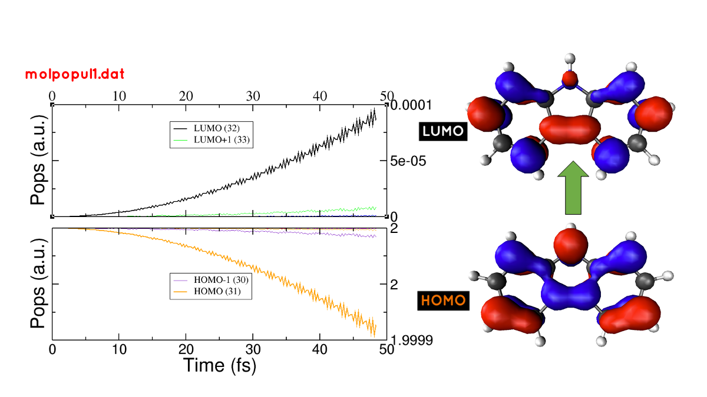
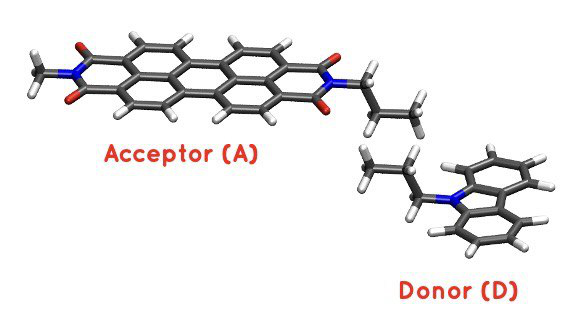

.. highlight:: none

***********************************************************************
Tutorial first steps: Absorption spectra, analysis and charge transfer
***********************************************************************

This is the tutorial presented in the DFTB+ school 2022 in Daresbury. The idea is to get used
to with the real-time TDDFTB method learning the basics of absorption spectra calculations and 
photoinduced processes like charge transfer under irradiation.

Spectra and analysis
====================

We will first calculate the absorption spectra of two different molecules and
analyse them using the tools provided by DFTB+.

Calculation of the absorption spectrum of carbazole
---------------------------------------------------

[Input: `recipes/electronicdynamics/tutorial/01_spectra_and_laser/01_carbazole/01_spectrum`]

We will calculate the absorption spectrum of the carbazole molecule

1. Take a look at the input coordinates *coords.gen*. The *.gen* format
   is the one used for DFTB+ code. In order to visualize the molecule,
   you can use the ``gen2xyz`` script, provided in the installation of the 
   DFTB+ code, doing::
     
     gen2xyz coords.gen

   This will generate a *coords.xyz* that you can open with VMD, Avogadro or
   any other molecular visualization software of your choice.

   .. figure:: ../_figures/elecdynamics/tutorial/carbazole.png
      :height: 30ex
      :align: center
      :alt: Carbazole molecule.

2. Open the *dftb_in.hsd_spec* file. This is a template for the calculation
   of the absorption spectrum.

   - Take a look at the ``ElectronDynamics`` block at the end of the file:: 
    
      ElectronDynamics = {
          Steps =                         #define the time window
          TimeStep [au] =                 #resolution of the spectrum
          Perturbation = Kick {           #must be a kick (Dirac delta)
              PolarizationDirection =     #desired direction/s
          }
          FieldStrength [v/a] =           #Field strength of the perturbation
      }

   - The input variables to be considered for the calculation of the spectrum are four:

     * ``Steps`` (integer): the number of steps of the dynamics. It defines the time window and,
       consequently, the energy window of the spectrum. The longer the dynamic, the lower the
       energies that can be reached in the spectrum are (also afected by the timestep, of course).
       Here, we will use 10000 steps.
     * ``TimeStep`` (float): the time step in time units. Usually 0.2 a.u (0.0048 fs). 
       It defines the resolution of the spectrum. The smaller the time step, 
       the higher the resolution within the time window.
     * ``Perturbation``: In this case we need a kick perturbation (Dirac delta) and we need to 
       specify the ``PolarizationDirection`` that could be *X*, *Y*, *Z* (if we are interested in 
       one particular direction) or *all* if we want to calculate the whole absorption spectrum.
       Set it as *all*.
     * ``FieldStrength`` (float): the field strength of the perturbation applied. For the
       calculation of the absorption spectrum, it must be within the linear response regime,
       i.e. usually 0.001 :math:`V/\AA`.

   - Complete the template file, copy it to *dftb_in.hsd* and run the calculation.

3. Once the dynamics ended, we will have 3 components of the dynamical dipole moment 
   (*mux.dat*, *muy.dat*, *muz.dat*). We need to Fourier-transform these dipole components
   in order to obtain the absorption spectrum of the molecule. To do this, we will use the
   ``calc_timeprop_spectrum`` tool available after installation of DFTB+ under: 
   *dftbplus/tools/misc/*. In the folder
   where you have the dipole files just type::

    calc_timeprop_spectrum -d 4 -f 0.001

   where the option -d is for the damping constant (in fs) applied to the dipole moment before transformation.
   The option -f stands for the field strength (in V/AA) of the perturbation applied during dynamic.

4. After running the script you will find two new files: *spec-nm.dat* and *spec-ev.dat* which are
   the absorption spectra in nm and eV, respectively. Plot the spectrum file with the plotting tool
   of your desire and look at the lower energy transitions. You should then see
   an absorption spectrum similar to:

   .. figure:: ../_figures/elecdynamics/tutorial/spec-nm-carbazole.png
      :width: 60%
      :align: center
      :alt: Absorption spectrum of carbazole molecule

      Absorption spectrum of carbazole molecule

5. Change the damping constant for a higher value, recalculate the specctrum and plot both spectra
   together. Which is the effect of the damping time in the spectrum?
   Here it is an example of the same spectrum obtained before, calculated with
   different values of the damping constant.

   .. figure:: ../_figures/elecdynamics/tutorial/specs-comparison-damp.png
      :width: 60%
      :align: center
      :alt: Influence of the damping constant value ``d`` in the absorption spectrum.

      Influence of the damping constant value ``d`` in the absorption spectrum.

Analysis of the absorption spectrum of carbazole
------------------------------------------------

[Input: `recipes/electronicdynamics/tutorial/01_spectra_and_laser/01_carbazole/02_laser`]

We will consider a laser perturbation in tune with the lowest energy
transition of the molecule in order to study the photodynamic
process of absorption in this transition. In order to do this, we
need to know the energy of the lowest energy transition of
the molecule (look for it in the spectrum plotted in the previous calculation)
and calculate the direction of maximal polarization of the transition.

1. Open the *dftb_in.hsd_laser* file. This is a template for the calculation
   of a laser perturbation.

   - Take a look at the ``ElectronDynamics`` block at the end of the file:: 
     
      ElectronDynamics = {
         Steps = 10000
         TimeStep [au] = 0.2
         Perturbation = Laser{              # Laser type perturbation
            LaserEnergy [nm] =              # energy of interest
            PolarizationDirection =         # calculate with calc_timeprop_maxpoldir
         }
         FieldStrength [v/a] = 0.001
         Populations = Yes                  # to write populations during dynamic
      }

     Now, the ``Perturbation`` type is a ``laser`` (and not anymore a ``kick``)
     and we need to specify two parameters:
         
         * ``LaserEnergy`` (float): the energy of the applied laser that may be
           the transition energy of interest. This value must be in energy units
           like eV but also nm is possible.
         * ``PolarizationDirection`` (vector): in the case of a laser, the 
           ``PolarizationDirection`` is 3-cartesian components vector in which the 
           laser will be applied. 

     Note that we turned on the ``Populations`` flag in order to write
     the occupations during the dynamics. Also note that we are asking for
     the detailed xml and the eigenvectors with the ``WriteDetailedXML``
     and ``WriteEigenvectors`` flags. We will need them to plot the orbitals
     with waveplot in the following sections. 

2. To complete the input template for the laser, we need to provide
   the ``LaserEnergy`` and the ``PolarizationDirection`` of the laser. Based on 
   our previous calculated spectrum, calculate the direction of maximal 
   polarization of the lowest energy transition of the molecule.

   - Help: use the tool ``calc_timeprop_maxpoldir`` already available in
     your installation (under: *dftbplus/tools/misc/*). To know how this
     tool work the user can just type::

      calc_timeprop_maxpoldir -h

   - Along which axes is the direction vector? How is this explained?
  
     - Hint: try to visualize the molecule and see how it is oriented with respect
       to the cartesian axes.
   
   + Solution: If you choose the lower energy transition of carbazole you may do::
      
      calc_timeprop_maxpoldir -10 -w 326

     and you will obtain the following transition dipole vector::
      
      PolarizationDirection = 0.99999221 0.00101174 -0.00381496

     which is essentially paralel to the *X* cartesian direction (because
     of the molecules orientation with respect to the cartesian axes)

3. Prepare the input for the dynamics under a continuous laser perturbation.
   Use the energy transition obtained from the spectrum as the ``LaserEnergy``
   and the vector obtained above as the ``PolarizationDirection`` of the 
   laser.

   - Why we should use this direction instead of any other?

4. After the dynamics, take a look at the *mu.dat* file.

   - Is the dipole moment increasing linearly?

   .. figure:: ../_figures/elecdynamics/tutorial/mu-carbazole-components.png
      :width: 60%
      :align: center
      :alt: mu components

      Dipole moment components vs time for the laser dynamics.

5. Take a look at the *molpopul.dat*
   generated. This file contains the populations projected on the GS orbitals during the dynamics.

   - Which orbitals are involved in the transition?
     Help: you can plot the *molpopul.dat* file using xmgrace::

      xmgrace -nxy molpopul.dat

     Look at the populations at y=2 (occupied orbitals in the GS basis) and find
     which curves are decreasing during the dynamic. These are the orbitals
     being depopulated.
     Look at the populations at y=0 (unoccopied orbitals in the GS basis) and find
     which curves are increasing during the dynamics. These are the orbitals
     being populated.

     You could also check in the *band.out* file generated from the SCC 
     calculation the states numbers. In the near of the Fermi energy, you 
     should see something like::

      29    -6.641  2.00000
      30    -5.809  2.00000
      31    -5.512  2.00000    #HOMO
      32    -1.983  0.00000    #LUMO
      33    -1.358  0.00000
      34    -0.501  0.00000

     where it is clear that states 31 and 32 are the HOMO 
     and LUMO of the molecule, respectively.   

6. Let's generate those orbitals using ``waveplot``

  - Look at the *waveplot_in.hsd_* template input file for waveplot:

    
    - Which files are needed?
    - In which orbitals are we interested?

  - After editing and completing this file, just rename it to *waveplot_in.hsd* and run
    ``waveplot`` using your current installed version that probably is at::
       
       $HOME/dftbplus/_build/app/waveplot/waveplot

  - After running waveplot, a number of files would be generated starting with "wp-1-1".

7. Let's plot these orbitals:

   - Open the cube files that correspond to the HOMO and LUMO and plot them as an isosurface.
     For that there are several software options. Particularly, we give here some links for VMD and VESTA:
     For a tutorial on the `Basics of VMD <https://www.ks.uiuc.edu/Training/SumSchool/materials/sources/tutorials/01-vmd-tutorial/html/node2.html>`_ and/or plotting an `isosurface <https://www.ks.uiuc.edu/Research/vmd/current/ug/node77.html>`_ method please refer to the links.
     VESTA allows the user to open directly cube files showing the isosurface instantaneusly
     with some default parameters. Really good for rapid examinations. `Download VESTA <https://jp-minerals.org/vesta/en/download.html>`_

Here we show a figure with the Populations obtained from the laser dynamics
and the orbitals involved in the transition. You should get something 
similar in your calculations:

   (left)Populations vs time for the laser dynamics. (right) Orbitals involved
   in the lower energy transition of the carbazole molecule.

Now is your turn! Calculation of PDI absorption spectrum
--------------------------------------------------------

[Input: `recipes/electronicdynamics/tutorial/01_spectra_and_laser/02_PDI/]

We will repeat the workflow used for the carbazole molecule with a new
molecule, PDI.

1. Based on the calculations that you ran before.

  - Calculate the absorption spectrum with a proper *dftb_in.hsd* input file.
  - Find the lowest energy transition.
  - Study the excitation process using a laser tuned with the transition.
  - Obtain the orbitals involved in the transition using waveplot and plot them.

Here we leave some figures from our calculations that could be useful to 
compare with your own calculations of this section:

.. figure:: ../_figures/elecdynamics/tutorial/PDI.png
   :width: 60%
   :align: center
   :alt: PDI

   \(a\) Absorption spectrum of the PDI molecule.\(b\) PDI molecule structure.\(c\) Dipole
   moment components vs time during a laser dynamics at 548 nm (note that in 
   this case the dipole moment in the *X* direction increases linearly).\(d\) Populations
   vs time for the laser dynamics.\(e\) Orbitals involved in the transition.

Photoinduced charge transfer
============================

Calculate the absorption spectrum of the Donor-acceptor aggregate
-----------------------------------------------------------------

[Input: `recipes/electronicdynamics/tutorial/02_photoinduced_CT/01_aggregate_spec/`]

1. Take a look at the input coordinates *coords.xyz* (you can open it using avogadro,
jmol, vmd, VESTA, etc).

   PDI+carbazole derivatives aggregate

It is an aggregate of the previous molecules analysed in which the carbazole and
PDI derivative act as donor and acceptor of electrons, respectively.

  - Convert the coordinates into *gen* format (use the ``xyz2gen`` script) and 
    calculate the absorption spectrum using the *dftb_in.hsd_spec* as a template
    for the input (copy this file or rename it as *dftb_in.hsd*).
    Note that after the electron dynamics, you will need (as before) to run the 
    Fourier transform of the induced dipole moment of the system (using the 
    ``calc_timeprop_spectrum`` tool) in order to obtain the spectrum.

2. Compare the calculated spectrum with the individual ones (you can use the spectra
   calculated before or recalculate them from these derivatives). Is there
   relevant differences?

   .. figure:: ../_figures/elecdynamics/tutorial/specs-compar-A+D.png
      :width: 60%
      :align: center
      :alt: A+D spectrum

      Absorption spectrum of the PDI+carbazole derivatives aggregate.

3. We are interested in the dynamics upon ilumination of the acceptor molecule. For such
   puropose, we will perform a laser dynamic in next step and for it, we need to calculate
   the transition dipole direction of the absorption band at ~530 nm. Calculate this vector
   using the `calc_timeprop_maxpoldir` tool. You shold obtain something similar to::

   PolarizationDirection = -0.99977920 0.01776644 0.01122075

   which is essentially the *X* direction (since the PDI molecule axis is 
   paralel to the *X* axis in the coordinates).

Laser dynamics on the donor-acceptor aggregate for charge transfer
------------------------------------------------------------------

[Input: `recipes/electronicdynamics/tutorial/02_photoinduced_CT/02_aggregate_CT/`]

1. With the transition dipole moment vector calculated previously, prepare
   your input for a laser-driven electron dynamics in tune with the acceptor (PDI)
   lowest energy excitation. Use the *dftb_in.hsd_pulse* as a template. Note
   that this time we add an envelope function to the laser perturbation in order
   to mimick a laser pulse::
      
      ElectronDynamics = {
         Steps = 20000
         TimeStep [au] = 0.2
         Perturbation = Laser{
            PolarizationDirection =       #calculate with calc_timeprop_maxpoldir
                                          #for the energy of interest
            LaserEnergy [nm] =
            }
         EnvelopeShape = Sin2{            #envelope shape type
         Time1 [fs] = 30.0                #pulse duration (assuming Time0 = 0, by default)
         }
         FieldStrength [v/a] = 0.02       #field strength bigger than spectrum case (0.001)
         WriteEnergyAndCharges = Yes
         Populations = Yes
      }
   
   Now in the ElectronDynamics we added the Sin2 ``EnvelopeShape`` with 
   a duration of 30 fs starting at the beginning of the dynamics. We will
   ask the code also to print the populations during dynamics to study the
   mechanism of charge transfer. Complete the input template filling the 
   ``PolarizationDirection`` and ``LaserEnergy`` obtained before and run the 
   code (don't forget to rename the template to *dftb_in.hsd*).

2. After running the electron dynamics, let inspect what give us de *qsvst.dat*
   file::

      #   time (fs) | total net charge (e) | charge (atom_1) (e) | ... |  charge (atom_N) (e)|
        0.000000000000000     -0.000000000000055    0.075753114169209   0.077680106829215  ...
        0.241888432650500     -0.000000000000048    0.075753940652948   0.077680933651269  ...
        0.483776865301000     -0.000000000000049    0.075758821681684   0.077685768802125  ...

   The first column of the file is the time and the second one is the total net charge
   of the system at each time step (which should keep near to zero). After that, we
   have one column for every atom charge at each time step (summing a total of N columns
   being N the number of atoms in the system). 
   Making use of the file *qsvst.dat* one may potencially get information
   about partial charges moving during dynamics. If you are interested in what is 
   happening with the charge of one molecule in your system, then you could sum the
   atom charges corresponding to that molecule (or part) of the system at each time
   and get some insights.

3. As we are interested in the charge transfer between both molecules after the pulse
   we want to process the information contained in the *qsvst.dat* to obtain the total
   charge of each molecule during the dynamics. For that, you could develope your own
   script but we also provide you a simple script based on this case to get that
   information. The provided tool ``calc_timeprop_charges.py`` will do the job.
   Try::

      ./calc_timeprop_charges.py --help

   to get info about how to use the script:: 
   
      usage: calc_timeprop_charges.py -l ii:jj,ll:mm

      Reads output from TD calculation with external laser and produces net charges per fragment
      (subtracting value at time = 0).

      Needs qsvst.dat file present in working directory.

      Options:
      -h, --help            show this help message and exit
      -l AT_LIST, --list=AT_LIST
                        list of atom indices starting from 1 (initial and
                        final index separated by colons, ranges separated by
                        commas)

   You will have to define the ranges of atoms that correspond to each of 
   the two molecules. In our case, the PDI derivative is between atom 1 and 52
   and the carbazole derivative is between atom 53 and 83. Then, you may do::

      ./calc_timeprop_charges.py -l 1:52,53:83

   After runing the script, two files may be generated: *charge_frag1.dat* and
   *charge_frag2.dat* with the corresponding charges of each defined fragment.
   If you plot it you will something like:

   .. figure:: ../_figures/elecdynamics/tutorial/charge-vs-time.png
      :width: 60%
      :align: center
      :alt: charge vs time

      Charge vs time for the accpetor and donor molecules.

   where it is clearly shown that during the dynamic the PDI molecule act as
   an accpetor of electrons getting negative values, meanwhile the carbazole is
   getting positive. This confirm the charge transfer upon ilumination.
   If we follow the protocol from before, ploting the populations and searching 
   for the orbitals involved in the transition, we should be able to get some
   insigths on the mechanism of the charge transfer (follow the steps in the
   prevous sections). As it is shown in the figure:

   .. figure:: ../_figures/elecdynamics/tutorial/molpopul-CT.png
      :width: 60%
      :align: center
      :alt: molpopul CT

      (left)Populations vs time for the pulse dynamics. (right) Orbitals involved
      in the excitation during the dynamics.
   
   the orbitals involved in the excitation with the pulse are localized in the
   PDI molecule, i.e. we can confirm that we are exciting the PDI molecule in 
   its own HOMO-LUMO transition (and not an HOMO-LUMO transition of the whole 
   system). Comparing with the previous figure of the charges dynamics, we can 
   also see that the CT process start just after a certain amount of electrons
   are excited in the PDI molecule (more or less 30 fs, the duration of the pulse
   used). So we could in principle divide the mechanism in two steps. The first
   one, from 0 to ~30 fs where the PDI is beeing excited. The second step is the
   charge transfer from the carbazole to the PDI once the last is already excited.
   

      

