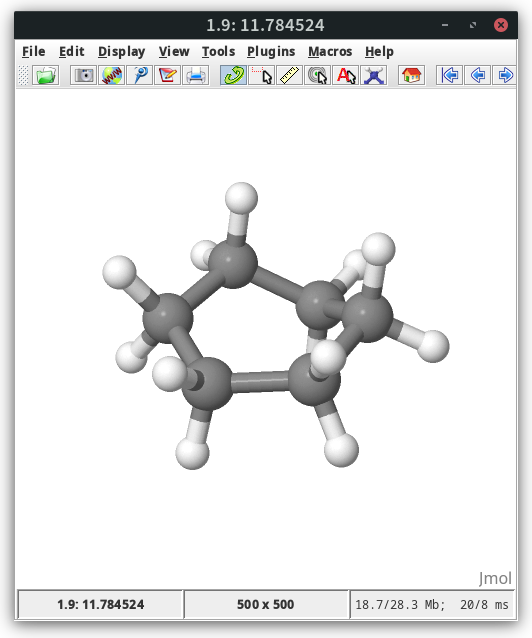

Reaction path search
====================

For many computational studies the kinetics of a reaction are important to provide insights into the feasibility of reactions.
Knowledge about the stationary points on the potential energy surface, like the minima and first order saddle points, provides the possibility to compute reaction energies as well as barrier heights.
To obtain a path from the reactants to the products on the potential energy surface, different techniques have been proposed, here we will be focusing on the growing string method (GSM) to generate reaction paths.\ :cite:`zimmerman2013`

Setting up GSM
--------------

For this tutorial we will use the GSM program available `here <https://github.com/grimme-lab/molecularGSM/releases/tag/rev1>`__.
While GSM has no native interface with DFTB+, it is possible to create an adapter which allows usage of DFTB+ from GSM.
The version of GSM used in this tutorial is ``gsm.orca``, which is formally an interface to the Orca quantum chemistry program and will invoke a program called ``ograd``.

.. dropdown:: Run script for DFTB+

   Our adapter for DFTB+ is implementing such an ``ograd`` program as a simple shell script

   .. literalinclude:: data/ograd
      :caption: \*ograd
      :language: sh

.. dropdown:: Convert script gradient output

   A companion script is provided to turn the DFTB+ produced nicely formatted output found in ``results.tag`` into the Orca standard output format

   .. literalinclude:: data/dp2orca.awk
      :caption: \*dp2orca.awk
      :language: awk

Make sure the ``ograd`` and ``dp2orca.awk`` script can be found in your executable ``PATH`` and are made executable.
With this setup we can run DFTB+ for computing our reaction path.

Cycloalkane inversion
---------------------

For our first application we will calculate the inversion barrier of a cyclohexane molecule.
Create a new directory for this reaction and create the input file GSM.
The most important settings are highlighted.

.. literalinclude:: data/inversion/inpfileq
   :caption: inpfileq
   :language: none
   :emphasize-lines: 18-19

``TS_FINAL_TYPE``:
  Declares whether a bond is broken in the reaction.
  ``0`` no bond breakage, ``1`` expect bond breakage.

``NNODES``:
  Number of nodes in the reaction path.
  The number of nodes determines the computational cost of the reaction path search.

Next we need to provide the starting structures.
For this purpose we use preoptimized structure of cyclohexane rotamers.

.. tab-set::

   .. tab-item:: coordinates
      :sync: xyz

      .. literalinclude:: data/inversion/reactant.xyz
         :caption: reactant.xyz

   .. tab-item:: image
      :sync: png

      .. image:: data/inversion/reactant.png
         :scale: 50%

.. tab-set::

   .. tab-item:: coordinates
      :sync: xyz

      .. literalinclude:: data/inversion/product.xyz
         :caption: product.xyz

   .. tab-item:: image
      :sync: png

      .. image:: data/inversion/product.png
         :scale: 50%

For our first calculation we will use GFN2-xTB

.. literalinclude:: data/inversion/dftb_in.hsd
   :caption: dftb_in.hsd
   :language: sh

Prepare the computation by creating the initial string file in the scratch directory

.. code-block:: shell

   ❯ ln -s $(which ograd)
   ❯ mkdir scratch
   ❯ cat reactant.xyz product.xyz > scratch/initial0000.xyz
   ❯ tree .
   .
   ├── dftb_in.hsd
   ├── inpfileq
   ├── ograd -> /path/to/ograd
   ├── product.xyz
   ├── reactant.xyz
   └── scratch
       └── initial0000.xyz

Before we run the GSM calculation, we should make sure that our setup does work and all scripts are found correctly

.. code-block:: text

   ❯ awk 'NR > 2 {print $0}' reactant.xyz > scratch/structure0000.test
   ❯ ./ograd 0000.test
   ❯ cat scratch/orcain0000.test.out
   ORCA-Dummy output for GSM TS Optimizer. Not a real ORCA-Output
   Total Energy       :    -18.98671575397980
   ------------------
   CARTESIAN GRADIENT
   ------------------

      0   X   :   -0.000022175   -0.000032523    0.000045093
      1   X   :    0.000018687   -0.000029431   -0.000041726
      2   X   :    0.000040745    0.000002303    0.000047600
      3   X   :    0.000021156    0.000031674   -0.000044042
      4   X   :   -0.000018965    0.000030712    0.000042849
      5   X   :   -0.000041579   -0.000002010   -0.000046430
      6   X   :    0.000010145    0.000017500   -0.000037834
      7   X   :    0.000021061    0.000036729   -0.000024695
      8   X   :   -0.000019945    0.000033848    0.000026075
      9   X   :   -0.000009533    0.000015825    0.000034222
     10   X   :   -0.000043791   -0.000000267   -0.000026704
     11   X   :   -0.000019442   -0.000000158   -0.000040573
     12   X   :   -0.000009583   -0.000016064    0.000037413
     13   X   :   -0.000022066   -0.000037434    0.000025531
     14   X   :    0.000019614   -0.000034118   -0.000025219
     15   X   :    0.000009869   -0.000017038   -0.000034806
     16   X   :    0.000020887    0.000000274    0.000039322
     17   X   :    0.000044914    0.000000178    0.000023924

Now we are ready to start the GSM calculation

.. code-block:: text
   :emphasize-lines: 32

   ❯ gsm.orca | tee gsm.out
    Number of QC processors: 1 
   ***** Starting Initialization *****
    runend 1
     -structure filename from input: scratch/initial0000.xyz 
   Initializing Tolerances and Parameters... 
     -Opening inpfileq 
     -reading file... 
     -using GSM 
     -RESTART: 0
     -MAX_OPT_ITERS: 80
     -STEP_OPT_ITERS: 30
     -CONV_TOL = 0.0005
     -ADD_NODE_TOL = 0.1
     -SCALING = 1
     -SSM_DQMAX: 0.8
     -SSM_DQMIN: 0.2
     -GROWTH_DIRECTION = 0
     -INT_THRESH: 2
     -SSM_MIN_SPACING: 5
     -BOND_FRAGMENTS = 1
     -INITIAL_OPT: 0
     -FINAL_OPT: 150
     -PRODUCT_LIMIT: 100
     -TS_FINAL_TYPE: 0
     -NNODES = 15
    Done reading inpfileq 

   ...

    oi: 8 nmax: 8 TSnode0: 8 overlapn: 0 
    string E (kcal/mol):  0.0 0.6 2.2 4.3 6.5 8.7 10.5 11.6 11.8 11.2 10.1 8.9 7.7 6.9 6.5 
    string E (au):  -18.98671575 -18.98573720 -18.98326126 -18.97986295 -18.97631228 -18.97290083 -18.97002972 -18.96825288 -18.96793564 -18.96894127 -18.97064022 -18.97246218 -18.97450365 -18.97574147 -18.97639692 
    string E (au) - force*distance:  -18.98671575 -18.98573720 -18.98326126 -18.97986295 -18.97631228 -18.97290083 -18.97002972 -18.96825288 -18.96793564 -18.96894127 -18.97064022 -18.97246218 -18.97450365 -18.97574147 -18.97639692 
    max E: 11.784524 for node: 8 

   ...

In the output we can find the energy of the forward barrier of 11.8 kcal/mol as estimated by the path search.
The final reaction path can be found in ``stringfile.xyz0000`` and can be visualized with the molecule viewer of your choice.
Note that the comment line contains the energy difference to the reactant in kcal/mol and some viewers, like `molden <https://www.theochem.ru.nl/molden/>`__, can plot this while visualizing the path.
In `jmol <http://jmol.sourceforge.net/>`__ the energy is visible in the lower left corner

To visualize the path extract the relative energies from the comment lines with

.. code-block:: text

   ❯ awk '$1 ~ /-?[0-9]+\.[0-9]+/ {print $0}' stringfile.xyz0000 > path000.txt

You can view the energy profile with `xmgrace <https://plasma-gate.weizmann.ac.il/Grace/>`__.

.. admonition:: Exercise
   :class: info

   Compute the inversion barrier with GFN2-xTB and plot the energy profile.

Diels-Alder reaction
--------------------

For the next example we will investigate a reaction path for a Diels-Alder reaction, including bond breaking / formation in the path search.
This time we want to investigate the effect of different methods for the final barrier height.
In the input file we choose more nodes and set the bond breaking flag.

.. literalinclude:: data/diels-alder/inpfileq
   :caption: inpfileq
   :language: none
   :emphasize-lines: 18-19

For the cycloaddition we use a furan and ethene molecule

.. tab-set::

   .. tab-item:: coordinates
      :sync: xyz-1

      .. literalinclude:: data/diels-alder/reactant.xyz
         :caption: reactant.xyz

   .. tab-item:: image
      :sync: png-1

      .. image:: data/diels-alder/reactant.png
         :scale: 50%

.. tab-set::

   .. tab-item:: coordinates
      :sync: xyz-1

      .. literalinclude:: data/diels-alder/product.xyz
         :caption: product.xyz

   .. tab-item:: image
      :sync: png-1

      .. image:: data/diels-alder/product.png
         :scale: 50%

For this path we want to investigate GFN1-xTB, GFN2-xTB, DFTB3-D4, DFTB2-D4, and LC-DFTB2-D4.
To ease the reaction path search the reactants should be optimized before running the path search.

.. tab-set::

   .. tab-item:: GFN2-xTB

      .. literalinclude:: data/diels-alder/gfn2-xtb.hsd
         :caption: dftb_in.hsd
         :language: sh

   .. tab-item:: GFN1-xTB

      .. literalinclude:: data/diels-alder/gfn1-xtb.hsd
         :caption: dftb_in.hsd
         :language: sh

   .. tab-item:: DFTB3-D4

      .. literalinclude:: data/diels-alder/dftb-3ob.hsd
         :caption: dftb_in.hsd
         :language: sh

   .. tab-item:: DFTB2-D4

      .. literalinclude:: data/diels-alder/dftb-mio.hsd
         :caption: dftb_in.hsd
         :language: sh

   .. tab-item:: LC-DFTB2-D4

      .. literalinclude:: data/diels-alder/dftb-ob2.hsd
         :caption: dftb_in.hsd
         :language: sh

For each of the five models we create a separate calculation directory and add the required ``dftb_in.hsd`` as well as the reactant and product input structure.
To optimize both structures we perform a short optimization with the reactant and product.
An example for running the optimization is given below

.. code-block:: shell

   ❯ for i in reactant product; do
   mkdir -p preopt-$i
   cp $i.xyz preopt-$i/struc.xyz
   cp dftb_in.hsd preopt-$i/dftb_in.hsd
   echo "Driver = GeometryOptimization {}" >> preopt-$i/dftb_in.hsd
   pushd preopt-$i
   dftb+ | tee dftb.out
   popd
   done

From the preoptimized structures we again setup a reaction path for the GSM program.
The following directory structure should be present before starting the actual reaction path search.

.. code-block:: shell

   ❯ ln -s $(which ograd)
   ❯ mkdir scratch
   ❯ cat preopt-reactant/geo_end.xyz preopt-product/geo_end.xyz > scratch/initial0000.xyz
   ❯ tree .
   .
   ├── dftb_in.hsd
   ├── inpfileq
   ├── ograd -> /path/to/ograd
   ├── preopt-product
   │   └── ...
   ├── preopt-reactant
   │   └── ...
   ├── product.xyz
   ├── reactant.xyz
   └── scratch
       └── initial0000.xyz

.. admonition:: Exercise
   :class: info

   Compare the barrier heights obtained with the different methods.
   Does any of the tested methods provide significant different results?
   Is the relative difference of the barrier heights in this case as expected?

Claisen rearrangement reaction
------------------------------

Another example is the Claisen rearrangement.
As starting structure we use `allyl vinyl ether <https://pubchem.ncbi.nlm.nih.gov/compound/221523>`_ and the corresponding `pentenale <https://pubchem.ncbi.nlm.nih.gov/compound/16418>`__.

.. tab-set::

   .. tab-item:: coordinates
      :sync: xyz-2

      .. literalinclude:: data/claisen/reactant.xyz
         :caption: reactant.xyz
         :language: none

   .. tab-item:: image
      :sync: png-2

      .. image:: data/claisen/reactant.png
         :scale: 50%

.. tab-set::

   .. tab-item:: coordinates
      :sync: xyz-2

      .. literalinclude:: data/claisen/product.xyz
         :caption: product.xyz
         :language: none

   .. tab-item:: image
      :sync: png-2

      .. image:: data/claisen/product.png
         :scale: 50%

.. admonition:: Exercise
   :class: info

   Compute the barrier height for the Claisen rearrangement.
   The expected barrier with GFN2-xTB is around 40 kcal/mol.

.. tip::

   The provided input structure might not be optimal, try to prepare the structures to find the optimal reaction path.

Transition metal reactions
--------------------------

Another interesting application of the GSM path finder together with tight binding methods is the investigation of transition metal complexes.\ :cite:`dohm2020`
For this exercises we will investigate several different reactions using the xTB Hamiltonian.

.. dropdown:: Metallabenzene vs. Rhodium Cp complex

   .. tab-set::

      .. tab-item:: coordinates
         :sync: xyz-3

         .. literalinclude:: data/mobh-15/reactant.xyz
            :caption: reactant.xyz

      .. tab-item:: image
         :sync: png-3

         .. image:: data/mobh-15/reactant.png
            :scale: 50%

   .. tab-set::

      .. tab-item:: coordinates
         :sync: xyz-3

         .. literalinclude:: data/mobh-15/product.xyz
            :caption: product.xyz

      .. tab-item:: image
         :sync: png-3

         .. image:: data/mobh-15/product.png
            :scale: 50%

.. dropdown:: Rhenium PNP pincer complex

   .. tab-set::

      .. tab-item:: coordinates
         :sync: xyz-4

         .. literalinclude:: data/mobh-25/reactant.xyz
            :caption: reactant.xyz

      .. tab-item:: image
         :sync: png-4

         .. image:: data/mobh-25/reactant.png
            :scale: 50%

   .. tab-set::

      .. tab-item:: coordinates
         :sync: xyz-4

         .. literalinclude:: data/mobh-25/product.xyz
            :caption: product.xyz

      .. tab-item:: image
         :sync: png-4

         .. image:: data/mobh-25/product.png
            :scale: 50%

.. dropdown:: Ruthenium pincer complex

   .. tab-set::

      .. tab-item:: coordinates
         :sync: xyz-5

         .. literalinclude:: data/mobh-14/reactant.xyz
            :caption: reactant.xyz

      .. tab-item:: image
         :sync: png-5

         .. image:: data/mobh-14/reactant.png
            :scale: 50%

   .. tab-set::

      .. tab-item:: coordinates
         :sync: xyz-5

         .. literalinclude:: data/mobh-14/product.xyz
            :caption: product.xyz

      .. tab-item:: image
         :sync: png-5

         .. image:: data/mobh-14/product.png
            :scale: 50%

.. admonition:: Exercise
   :class: info

   Find the reaction paths for the three transition metal reactions with GFN2-xTB.
   Compare the computed barrier heights and reaction energies with the reference values
   computed by localized coupled cluster or double hybrid density functionals given below
   (in kcal/mol).

   ======= ========= ==========
    Metal   Barrier   Reaction
   ======= ========= ==========
    Ru        20.27    –56.96
    Re         2.66     –9.35
    Rh        10.35     –3.32
   ======= ========= ==========

Summary
-------

.. admonition:: You learned...
   :class: important

   - to prepare starting structures for a reaction path search
   - perform a reaction path search with the growing string methods
   - compare reaction paths from different semiempirical methods
