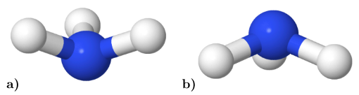
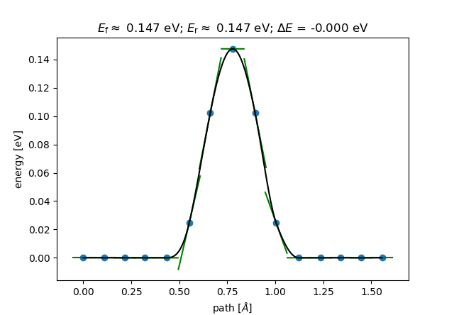

.. highlight:: none
.. _sec-interfaces-ase-neb-fileio:

***************
NEB via File-IO
***************

[Input: `recipes/interfaces/ase/neb/fileio/`]

In order for ASE to find the DFTB+ executable and Slater-Koster files,
environment variables must be set. Assuming the use of the BASH shell, this is
done as follows (in general an adaptation to your specific computing environment
will be necessary)::

    $ DFTB_PREFIX=~/slakos/mio-0-1/
    $ DFTB_COMMAND=~/dftbplus/bin/dftb+

.. _sec_interfaces_ase_neb_fileio-geometry:

Geometry
--------

To calculate the energy barrier of the umbrella inversion process, it is
necessary to provide geometries for the initial and final state.

A possible choice for the .gen files defining the initial and final state of
the calculation could be the following:

`initial state`::

    4  C
  N  H
    1 1    0.3282523436E+00   -0.6075947736E+00    0.1062852063E+00
    2 2    0.1193013364E+01   -0.3265926020E+00    0.5715962197E+00
    3 2    0.2770647466E+00   -0.1801902091E+00   -0.8199941035E+00
    4 2   -0.4767004541E+00   -0.3215324152E+00    0.6662026774E+00

`final state`::

    4  C
  N  H
    1 1    0.3206429517E+00   -0.6319775238E+00    0.1527307910E+00
    2 2    0.1179077740E+01   -0.1010702015E+01    0.5563961495E+00
    3 2    0.2628891413E+00   -0.8794981362E+00   -0.8365549890E+00
    4 2   -0.4905898328E+00   -0.1001302325E+01    0.6515180485E+00

:numref:`fig_interfaces_ase_neb_fileio-states_initial_final`
visualizes the defined geometries. The |NH3| molecule passes through a planar
transition state, thus inverting the pyramidal shape:

.. _fig_interfaces_ase_neb_fileio-states_initial_final:

          inversion.

    Initial a) and final b) state of the |NH3| (ammonia) umbrella inversion.

.. |NH3| replace:: NH\ :sub:`3`\

.. _sec_interfaces_ase_neb_fileio-mainscript:

Main script
-----------

The Python script shown below is a suitable and simple implementation to run a
calculation with `NIMAGES` as the number of intermediate images
(in this case set to 13).

The main method then first reads in the geometry and immediately writes it out
for the reasons mentioned in :ref:`Socket-Comm.: Geometry Optimization by ASE
<sec_interfaces_ase_sockets-geoopt-input>`. The trajectories (obtained from
previous calculations) of the initial and final state are read in and a list
with the individual images is created, whereby the first and last image is
determined by the states that have just been read in. True, independent copies
of the first image are created for the 13 intermediate images. A NEB object is
instantiated and a linear interpolation of the path from the intial and final
state is calculated.

Subsequently, the ASE driver ``BFGS()`` for geometry optimization is specified
and where to write the resulting trajectory (`i2f.traj`). A list of instantiated
DFTB calculators is created and its elements attached to the single intermediate
images. Finally the calculation is started by calling the `run` command,
while passing the maximum force component `fmax` (mind the
`ASE Units <https://wiki.fysik.dtu.dk/ase/ase/units.html>`_!):

.. code-block:: python

    from ase.io import read, write
    from ase.neb import NEB
    from ase.optimize import BFGS
    from ase.calculators.dftb import Dftb

    NIMAGES = 13

    def main():
        '''Main driver routine.'''

        initial = read('NH3_initial.traj')
        final = read('NH3_final.traj')

        images = [initial]
        images += [initial.copy() for ii in range(NIMAGES)]
        images += [final]

        neb = NEB(images)
        neb.interpolate()

        opt = BFGS(neb, trajectory='i2f.traj')

        calcs = [Dftb(label='NH3_inversion',
                      Hamiltonian_SCC='Yes',
                      Hamiltonian_SCCTolerance='1.00E-06',
                      Hamiltonian_MaxAngularMomentum_N='"p"',
                      Hamiltonian_MaxAngularMomentum_H='"s"')
                 for ii in range(NIMAGES)]

        for ii, calc in enumerate(calcs):
            images[ii + 1].set_calculator(calc)

        opt.run(fmax=1.00E-02)

    if __name__ == "__main__":
        main()

.. _sec_interfaces_ase_neb_fileio-analysis:

Analysis
--------

The results of the NEB calculation can be extracted out of the trajectory file
`i2f.traj` using corresponding ASE tools. If only the last 15 images
(intermediate images plus initial and final state) are of interest, a
construction like the following one would be suitable::

    ase gui i2f.traj@-15:

Since ASE is capable of quickly visualizing the reaction path via the
:menuselection:`Tools --> NEB` tab, you should obtain something similar to
:numref:`fig_interfaces_ase_neb_fileio-energy_barrier`:

.. _fig_interfaces_ase_neb_fileio-energy_barrier:

          molecule.

    Energy barrier of the umbrella inversion of a single |NH3| (ammonia)
    molecule.

Since the initial and final state are identical after a suitable unitary
transformation, the energetic difference :math:`\Delta E` between the
states obviously vanishes.
