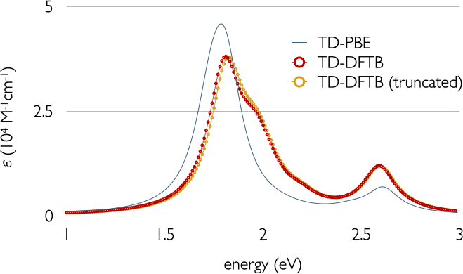

.. highlight:: none

**************************************
Absorption spectrum of a macromolecule
**************************************

[Input: `recipes/linresp/macromolecule/`]

In this recipe, we increase significantly the dimension of our system, and hence
of our eigenvalue problem. The structure in question is :math:`C_{66}O_{10}N_{4}H_{44}`.
This is a more realistic target system for a TD-DFTB calculation. Our goal is to
compute the absorption spectrum of this molecule up to approximately 1 Hartree.
To cover this energy range, we will need to obtain the first 20 singlet excitation
energies and oscillator strengths. This is computed as usual::

  ExcitedState {
      Casida {
          NrOfExcitations = 20
          Symmetry = singlet
      }
  }

After obtaining the energy and oscillator strength pairs (takes very few
minutes), we can use a simple script to plot the absorption spectrum. The
script (*spectrum.py*) is provided in the input folder and requires Python 3.
Simply run::

  python spectrum.py > abs.dat

and plot the content of *abs.dat* with your graphing tool of preference.
The script employs a Lorentzian function for the spectral broadening, with a
full width at half-maximum parameter of :math:`\Gamma` = 0.2 eV. Specifically,
what is plotted is the molar extinction coefficient, defined as

.. math:: \varepsilon(\omega) = \sum_I \frac{f_{I}}{C\pi}
   \frac{\Gamma/2}{(\omega-\omega_I)^2 + (\Gamma/2)^2}

The sum runs over all computed excitations :math:`I`, with energy :math:`\omega_I`
and oscillator strength :math:`f_I`. The factor :math:`C` = 3.5 × :math:`10^{-5}` M cm/eV.

Windowing
=========

For the study of excitations with low-to-medium collective character, as in our example,
it is possible to reduce considerably the dimension of the response matrix by
disregarding Kohn-Sham (KS) transitions with small coupling to the excitations in question. This
can be achieved in practice by systematically discarding those orbital pairs
:math:`\phi_{p\sigma}` and :math:`\phi_{q\sigma}` with energy differences :math:`\epsilon_{p\sigma} - \epsilon_{q\sigma}` away
from the excitation energies of interest. In DFTB+, this is done by defining an
energy windows that sets a threshold for all KS transitions entering the Casida
equation. For the computation of excitation energies, energy windows can often
be set fairly small, without losing accuracy. On the other hand, for the study
of absorption spectra, energy windows need to be defined larger, as oscillator
strengths are much more sensitive to even small values of the off-diagonal
elements of the response matrix. However, DFTB+ offers the possibility to set an
orbital constraint based on both energy and oscillator strength values. Thus,
additionally to the energy window, it is possible to define an oscillator
strength cutoff in the calculations. Our experience tells us that with the
combination of both truncations, the dimension of the response matrix can be
reduced significantly more than with the use of only the energetic constraint,
for a given accuracy.

For our macromolecule, we will set an energy cutoff of 0.1 Hartree beyond the
energy region of interest (defined by the first 20 single-particle transitions
and roughly equal to 1 Hartree). As for the oscillator strength window, we will
use a cutoff of :math:`10^{-3}`. These values ensure a negligible loss of accuracy in
the optical spectra, while reducing the computation time by roughly half. Those are
specified in the *Casida* block using the *EnergyWindow* and *OscillatorWindow* keywords::

  ExcitedState {
      Casida {
          NrOfExcitations = 20
          Symmetry = singlet
          EnergyWindow = 0.1
          OscillatorWindow = 0.001
      }
  }

The resulting spectra with and without truncation of the KS transitions can be
observed in the following figure:

We have also provided TD-DFT results using the PBE functional and a triple-Z plus polarisation basis
set for comparison. To put this into perspective, we needed roughly five days to
obtain the PBE spectra under the same computational conditions.
