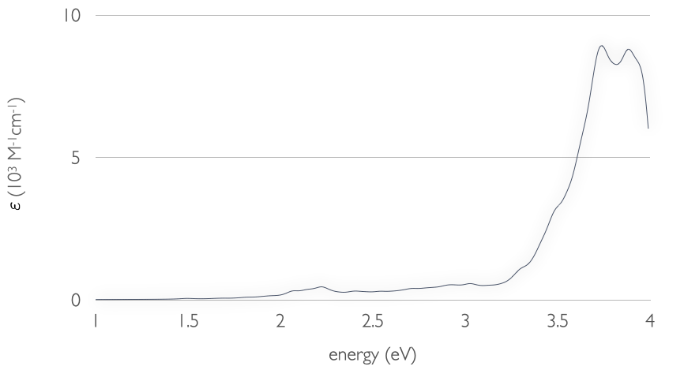

.. highlight:: none

**************************************
Absorption spectrum of NO-TiO2 complex
**************************************

[Input: `recipes/linresp/no-tio2/`]

Our previous example shows how TD-DFTB can tackle large molecules at a fraction of
the computational cost needed by more sophisticated methods. However, a
first-principle calculation of this complexity presents only a very minor challenge
for today's average supercomputers. In this recipe, we raise again the bar and
show how a problem that is unfeasible to practically solve at the DFT level of
theory, can be easily addressed using DFTB+ on a modern personal computer.

The system in question is a NO molecule adsorbed on the rutile (110) titania surface. We
employ a cluster model as shown in the next figure:

.. figure:: ../_figures/linresp/no-tio2_geo.png
   :height: 36ex
   :align: center
   :alt: NO-TiO2 cluster model.

We would like to compute the absorption spectrum of this complex up to the UV-A
region, so that we can observe both near band-gap excitations of TiO\ :sub:`2` and
ligand-to-substrate charge-transfer (CT) transitions in the visible range. The
challenge here is in the high number of excitations that need to be solved for to
cover the desired energy region. Specifically, we have to set *NrOfExcitations*
to 1200 to cover a region of up to 4 eV::

  ExcitedState {
      Casida {
          NrOfExcitations = 1200
          EnergyWindow = 0.01
          Diagonaliser = Arpack{}
      }
  }

we have set *EnergyWindow = 0.01* to save in computational time. We can
choose such a small energy cutoff as titania band-to-band transitions have a
rather low collective character. The visible range of the spectrum, which is of
most interest, is negligibly affected by this truncation, as the CT absorption
bands are away from the energy window frontier. This constraint speeds up the
calculation roughly 7 times!

After obtaining the *EXC.DAT* output file (we provide it in the recipe folder as
the calculation will take some time to complete), we can run the *spectrum.py*
script to obtain the absorption spectrum. Only those transition with a spin
contamination smaller than 0.5 will be considered. This value is hard-coded in
*spectrum.py*, and the reader can modify it at his/her convenience. The
absorption spectrum should finally look like this:

