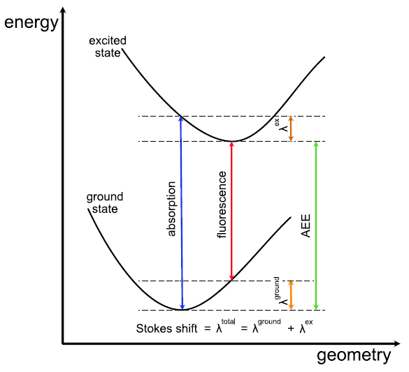

.. highlight:: none

****************************************
Geometry relaxation in the excited state
****************************************

So far we have only looked at excited state calculations at fixed
geometry. *DFTB+* supports also geometry relaxations or even MD
simulations in a given excited state. In this example we are going to
study the absorption and fluorescence energies of the simple molecule
thioformaldehyde (:math:`{SCH}_2`).

Thioformaldehyde absorption
===========================

[Input: `recipes/linresp/range-separated/relax/abs`]

We are starting with a geometry that has already been relaxed in the
ground state. Performing a TD-DFTB calculation at this geometry yields
the following spectrum (EXC.DAT)::

  w [eV]       Osc.Str.         Transition         Weight      KS [eV]    Sym.
 
  ================================================================================
 
      1.848        0.00000000         6   ->     7        1.000       1.848      S
      4.770        0.10134777         5   ->     7        0.999       3.837      S
      5.077        0.00000000         4   ->     7        1.000       5.077      S
      5.467        0.00126721         6   ->     8        1.000       5.457      S
      6.000        0.00000000         3   ->     7        1.000       6.000      S
      7.128        0.00006156         6   ->     9        1.000       7.128      S
      7.138        0.00000000         6   ->    10        1.000       7.138      S
      7.327        0.02861414         6   ->    11        1.000       7.224      S
      7.446        0.00000000         5   ->     8        1.000       7.446      S
      8.964        0.08762770         4   ->     8        1.000       8.685      S
 
Note that we are only interested in singlet states here, since
absorption to triplet states is spin forbidden. We will focus on the
first excited state (:math:`{S}_1`).

Thioformaldehyde absorption
===========================

[Input: `recipes/linresp/range-separated/relax/abs`]

We are starting with a geometry that has already been relaxed in the
ground state. Performing a TD-DFTB calculation at this geometry yields
the following spectrum (EXC.DAT)::

  w [eV]       Osc.Str.         Transition         Weight      KS [eV]    Sym.
 
  ================================================================================
 
      1.848        0.00000000         6   ->     7        1.000       1.848      S
      4.770        0.10134777         5   ->     7        0.999       3.837      S
      5.077        0.00000000         4   ->     7        1.000       5.077      S
      5.467        0.00126721         6   ->     8        1.000       5.457      S
      6.000        0.00000000         3   ->     7        1.000       6.000      S
      7.128        0.00006156         6   ->     9        1.000       7.128      S
      7.138        0.00000000         6   ->    10        1.000       7.138      S
      7.327        0.02861414         6   ->    11        1.000       7.224      S
      7.446        0.00000000         5   ->     8        1.000       7.446      S
      8.964        0.08762770         4   ->     8        1.000       8.685      S
 
Note that we are only interested in singlet states here, since
absorption to triplet states is spin forbidden. We will focus on the
first excited state (:math:`S_1`) at 1.848 eV, which has symmetry
:math:`A_2`. This symmetry can be inferred by inspection of the
molecular orbitals involved in the transition, but we will not do so
in this recipe. The state at 4.77 eV has much larger oscillator
strength, but in real life also the :math:`S_1` state will be very
weakly absorbing due to electron-phonon coupling. This is however not
taken into account at the present level of theory. Due to symmetry,
the oscillator strength is exactly zero in our example.

Adiabatic excitation energies
=============================

[Input: `recipes/linresp/range-separated/relax/emi`]

We now relax the structure in the first excited state. The input
(dftb_inp.hsd) for this task looks like this::

  Geometry = GenFormat {
      <<< "in.gen" 
  }

  Driver = LBFGS {}

  Hamiltonian = DFTB {
    
      SCC = Yes
      SCCTolerance = 1.0E-10
      MaxAngularMomentum = {
          S = "d"
          C = "p"
	  H = "s"
      }
      SlaterKosterFiles = Type2FileNames {
          Prefix = "../../../slakos/download/mio/mio-1-1/"
          Separator = "-"
          Suffix = ".skf"
      }
  }

  ExcitedState {
      Casida {
          NrOfExcitations = 10
    	  StateOfInterest = 1 
          Symmetry = Singlet
    	  Diagonaliser = Stratmann {SubSpaceFactor = 30}
      }
  }

  ParserOptions = {
      ParserVersion = 10
  }

In contrast to the earlier examples in this recipe, we now set a
``Driver``. We choose LBFGS optimization, but one could also take any
other optimizer available in *DFTB+*. You may also set convergence
criteria for the forces like detailed in the recipe
:ref:`sec-basics`. Important is the new entry in the ``Casida`` block
``StateOfInterest``. It tells the code to optimize on the :math:`S_1` 
potential energy surface. It is recommended to choose
``NrOfExcitations`` always somewhat larger (i.e., +5) as
``StateOfInterest``, since iterative eigensolvers might not converge to
the exact solution for boundary eigenvalues. Note also that during a
relexation the order of the excited states might change. This is a
frequent cause of error in these kind of simulations.

You should see that the geometry optimization finishes in a few
steps. Visualizing the relaxed structure shows that the S-C bond
length increased by 0.5 Angstroem. The experimental value for the bond
length in the :math:`S_1` is 1.68 Angstroem. What do you get?

During the optimization, the file `EXC.DAT` is constantly updated. Let
us have a look at the final result::

      w [eV]       Osc.Str.         Transition         Weight      KS [eV]    Sym.
 
   ================================================================================
 
      1.738        0.00000000         6   ->     7        1.000       1.738      S
      4.512        0.10509561         5   ->     7        0.999       3.516      S
      4.846        0.00000000         4   ->     7        1.000       4.846      S
      5.386        0.00097579         6   ->     8        1.000       5.379      S
      5.915        0.00000000         3   ->     7        1.000       5.915      S
      7.157        0.00000000         5   ->     8        1.000       7.157      S
      7.204        0.00005764         6   ->     9        1.000       7.204      S
      7.215        0.00000000         6   ->    10        1.000       7.215      S
      7.445        0.01593134         6   ->    11        1.000       7.384      S
      8.818        0.10121357         4   ->     8        1.000       8.487      S

We see that the excitation energy of the :math:`S_1` decreased by 0.11
eV. This value corresponds to the so-called Stokes shift, which
measures the difference between absorption and fluorescence
energies. In the present example, absorption and radiative
de-excitation from the :math:`S_1` (i.e., fluorescence) should be very
difficult to detect, as already mentioned above. The following diagram
illustrates the energetic landscape:

.. _fig_aee:

     Sketch of the adiabatic excitation energy (AEE), reorganization
     energies :math:`\lambda` in the ground and excited states, and
     Stokes shift [Taken from Sokolov et al., JCTC 17, 2266 (2021)]

We will now compute the adiabatic excitation energy. As the diagram
:numref:`fig_aee` shows, this requires the ground state energies of
the starting structure and the relaxed structure. We can get these
from the respective `detailed.out` files. The experimental value is
2.03 eV, what do you get?
