.. highlight:: none

*******************************************************
Electron transport calculations in armchair nanoribbons
*******************************************************

In this chapter we will learn how to set up self-consistent and
non-self-consistent simulations with open boundary conditions by using DFTB+. We
will then calculate the density of states and the transmission coefficients and
analyse the results in comparison with the previous periodic calculations.

Non-SCC pristine armchair nanoribbon
====================================

[Input: `recipes/transport/carbon2d-trans/agr-nonscc/ideal/`]

Preparing the structure
------------------------

When we run a transport calculation with open boundary conditions, the geometry
specified in the input needs to obey some rules (see
:ref:`specifying-geometry`). The system must consist of an extended device (or
molecule) region, and two or more semi-infinite bulk contacts. The bulk contacts
are described by providing two *principal layers* for each contact.

A *Principal Layer (PL)* is defined as a contiguous group of atoms that have
finite interaction only with atoms belonging to adjacent PLs. In a sense, a PL
is a generalisation of the idea of nearest neighbour atoms to the idea of
nearest neighbour blocks. The PL partitioning in the electrodes is used by the
code to retrieve a description of the bulk system. PLs may be defined, as we
will see, in the extended device region to take advantage of the iterative
Green's function solver algorithm.

Additional information about the definition of PLs, contacts and extended device
region can be found in the manual.

In the case of an ideal one-dimensional system, all the PLs are identical. The
system we start with is an infinite armchair graphene nanoribbon (AGR),
therefore the partitioning into device and contact regions is somewhat
arbitrary. We will therefore start from a structure file containing a single PL
(`2cell_7.gen`), which has been previously relaxed. The PL can be converted to
XYZ format by using the `gen2xyz` script and visualised with `Jmol`::

  gen2xyz 2cell_7.gen
  jmol 2cell_7.xyz

The structure is shown in :numref:`fig_transport_carbon2d-trans_2cell-7`

.. _fig_transport_carbon2d-trans_2cell-7:
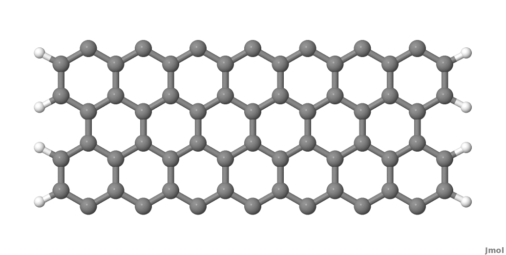

   Armchair nanoribbon principal layer (PL)

As you may notice, we did not take a single unit cell length as a PL, but rather
two unit cells of the graphene conventional unit cell. This choice is dictated
by the definition of the PL itself, as we want to avoid non-zero interactions
between second-neighbour PLs. This is better explained by referring to Figure
:ref:`fig_transport_carbon2d-trans_4cell-7`. The red carbon atoms represent the
closest atoms which would belong to non-nearest neighbour PLs, and these have a
separation of 0.568 nm, as shown in Figure
:ref:`fig_transport_carbon2d-trans_4cell-7`. The carbon-carbon interaction is
non-zero up to a distance of 6 a.u., therefore the interaction between the two
red atoms would be small but non-zero. Hence this is too small a separation for
a one unit cell long section of nanoribbon to be used as the PL.

.. _fig_transport_carbon2d-trans_4cell-7:
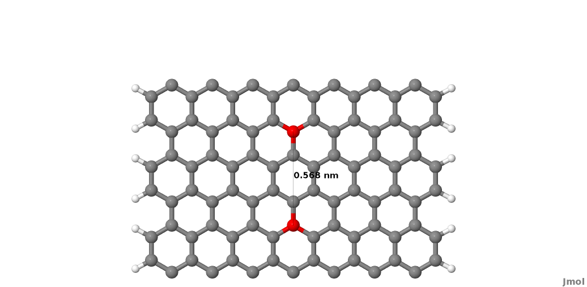

   Layer definition

In this case the PL must contain two unit cells, in this case, as shown in
figure :ref:`fig_transport_carbon2d-trans_4cell-7`. It follows that the correct
definition of a PL depends both on the geometry of the system and the
interaction cut-off distance as defined in the SK files (In the first line of
the SK-files this is given as the grid spacing in atomic units and the number of
grid points in the file).  The cutoff distance can be shortened slightly using
the option `TruncateSKRange` in the Hamiltonian section, however users should be
aware that this impacts the electronic properties of the system, hence should be
used by experts only.

After having defined a proper PL, we then build a structure consisting of a
device region with 2 PLs and contacts at each end of this region, each
consisting of 2 PLs.

*Note*: For the pristine system, intensive properties in equilibrium
calculations should not depend on the length of the device region, as the
represented system is an infinite ideal nanoribbon with discrete translational
symmetry along the ribbon.

The input atomic structure must be defined according to a specific ordering: the
device atoms come first, then each contact is specified, starting with the PL
closer to the device region. For an ideal system defined by repetition of
identical PLs, the tool `buildwire` (distributed with the DFTB+ code) can be
used to build geometries with the right ordering.

When you type::

  buildwire 2cell_7.gen 3 2

the code use the geometry contained in the input supercell (`2cell_7.gen`),
assuming direction 3 (=z) is the transport direction and that the number of
principal layers in the device region will set this to be 2.

The code `buildwire` then will produce the correct transport block for
dftb_in.hsd::

  Transport{
    Device{
      AtomRange = 1 136
      FirstLayerAtoms = 1 69
    }
    Contact{
      Id = "source"
      AtomRange = 137 272
    }
    Contact{
      Id = "drain"
      AtomRange = 273 408
    }
    Task= contactHamiltonian{
      contactId = "source"
    }
  }

A file `Ordered_2cell_7.gen` will have been created, which we will rename 
`device_7.gen` using the following::

  mv Ordered_2cell_7.gen device_7.gen

We can better understand the ordering of the atomic indexes if we convert this
structure to XYZ, open it with jmol and then change the colours of specific
ranges of atoms by using the following syntax in the jmol console (for example,
we select here the first contact and split it into two sub-ranges containing its
first and second PLs)::

  > select atomno>136 && atomno<205
  > color yellow
  > select atomno>204 && atomno<273
  > color red

In :numref:`fig_transport_carbon2d-trans_color-device-7` a `Jmol` export of
the structure is shown.

.. _fig_transport_carbon2d-trans_color-device-7:
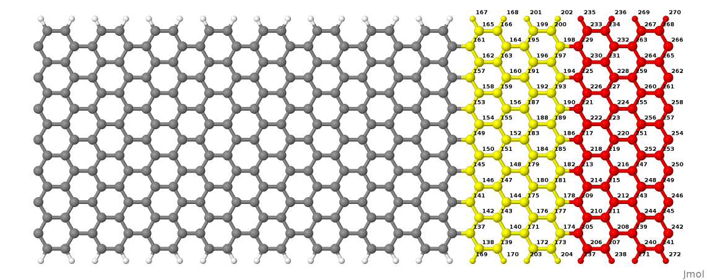

   The PLs of contact 1

The yellow and red atoms represent the first and second PLs of the first
contact. When you build a structure yourself, it is always a good idea to use a
visualiser and verify that the atomic indices are consistent with the transport
setup definitions.

The last step is to make sure the structure is defined as a *cluster*.  From the
point of view of an open boundary condition calculation, supercells (``S``) and
clusters (``C``) have slightly different meanings compare with canonical DFTB
calculations. By supercell we mean any structure which is *periodic in any
direction transverse to the transport direction*, while for cluster we mean any
structure *not periodic in any direction transverse to transport*. It follows
that purely 1D systems, like nanowires and nanoribbons, should be regarded as
clusters (``C``). Therefore we edit the structure file `device_7.gen`, changing
in the first line the ``S`` (supercell) to be ``C`` (cluster) and remove the
last four lines, which would normally only be defined for periodic systems. The
newest versions of `buildwire` should automatically do this. The corrected
definition for the 1D ribbon with open boundary conditions is then::

  408  C
  C    H
    1    1     37.831463060000    -20.000000000000      0.710000000000
    2    1     39.061219140000    -20.000000000000      1.420000000000
    3    1     39.061219140000    -20.000000000000      2.840000000000
    4    1     37.831463060000    -20.000000000000      3.550000000000
    5    1     35.371950920000    -20.000000000000      0.710000000000
    6    1     36.601706990000    -20.000000000000      1.420000000000
    7    1     36.601706990000    -20.000000000000      2.840000000000
    8    1     35.371950920000    -20.000000000000      3.550000000000
    ........
    65    2     20.880312110000    -20.000000000000    -11.870830122700
    66    2     20.880312110000    -20.000000000000     -9.429169877000
    67    2     40.025607920000    -20.000000000000    -11.870893735700
    68    2     40.025607920000    -20.000000000000     -9.429106264000

Now the file `device_7.gen` contains the correct structure, defined as a cluster
and with the proper atom ordering. Next, we set up the input file for a
tunnelling calculation.

Transmission and density of states
----------------------------------

In the following we will first set up the simplest open boundary condition
calculation: transmission coefficients according to the Landauer-Caroli formula,
assuming a non-SCC DFTB hamiltonian. We will discuss and comment the different
sections contained in the file `dftb_in.hsd`.

First, we have the specification of the geometry::

  Geometry = GenFormat {
  <<< 'device_7.gen'
  }

This follows the same rule as in a regular DFTB+ calculation, except for the
fact that the structure should follow the specific partitioning structure
explained in the previous section.

Whenever an open boundary system is defined, we have to specify a block named
``Transport`` which contains information on the system partitioning and
additional information about the contacts to the device::

  Transport {
    Device {
      AtomRange = 1 136
      FirstLayerAtoms =  1 69
    }
    Contact {
      Id = "source"
      AtomRange = 137 272
      FermiLevel [eV] = -4.7103
      potential [eV] = 0.0
    }
    Contact {
      Id = "drain"
      AtomRange = 273 408
      FermiLevel [eV] = -4.7103
      potential [eV] = 0.0
    }
  }

Here we have used the indexes printed by `buildwire`. ``Device`` contains two
fields: ``AtomRange`` specifies which atoms belong to the extended device region
(1 to 136) and ``FirstLayerAtoms`` specify the starting index of the PLs in the
device region. This field is optional, but if not specified the iterative
algorithm will not be applied and the calculation will be slower, even though
the result will be still correct.  Then we have the definitions of the
contacts. In this example we define a two terminal system, but in general N
contacts are allowed. A contact is defined by an ``Id`` (mandatory), the range
of atoms belonging to the contact specified in ``AtomRange`` (mandatory) and a
``FermiLevel`` (mandatory). The potential is set by default to 0.0, therefore
need not be specified in this example.

Note that in non-SCC calculations that do not compute the Density Matrix of the
system, the Fermi level and the contact potential are not necessary to calculate
a transmission curve, but they are needed to calculate the current via the
Landauer formula, as they would determine the occupation distribution in the
contacts.

Then we have the ``Hamiltonian`` block, describing how the initial
Hamiltonian and the SCC component, if any, will be calculated::

  Hamiltonian = DFTB {
    SCC = No
    MaxAngularMomentum {
      C = "p"
      H = "s"
    }
    SlaterKosterFiles = Type2FileNames {
      Prefix = "../../slako/"
      Separator = "-"
      Suffix = ".skf"
    }
    Eigensolver = TransportOnly{}
  }

In this example we will calculate the transmission according to the Caroli
(referred by some authors as the Fisher Lee) formula in a non-SCC approximation,
i.e. the Hamiltonian is directly assembled from the Slater-Koster files and used
"as is" to build the contact self energies and the extended device Green
function.  The definition of an eigensolver is not meaningful in an open
boundary setup, as the system is instead solved by the Green function
technique. Therefore we just use a keyword ``TransportOnly`` to indicate that we
do not want to solve an Eigenvalue problem. The other fields are filled up in
the same way as for a regular DFTB calculation.

Usually in DFTB+ an eigensolver is regarded as a calculator which can provide
the charge density in the SCC cycle, therefore we will instead define a Green's
function based solver later, but only for SCC calculations.

Note that as C-H bonds are present in the system, charge transfer should occur,
hence the result will not be accurate at the non-SCC level. It is not *a-priori*
trivial to predict whether this affects qualitatively or quantitatively the
transmission. We will therefore later compare these results with an SCC
calculation - at the moment we will stay at the level of a non-SCC calculation,
because it is faster to execute and also allows us to use the simplest input
file possible.

Finally, the implementation of the Landauer-Caroli formula is regarded as a
post-processing operation and specified by the block ``TunnelingAndDos`` inside
``Analysis``::

  Analysis {
    TunnelingAndDos {
      Verbosity = 101
      EnergyRange [eV] = -6.5  -3.0
      EnergyStep [eV] = 0.01
      Region {
        Atoms = 1:136
      }
    }
  }

``TunnelingAndDos`` allows for the calculation of Transmission coefficient,
Local Density of States (LDOS) and current. A transmission is always calculated
using the energy interval and energy step specified here. The LDOS is only
calculated when sub-blocks ``Region`` are defined. ``Region`` can be used to
select some specific subsets of atoms or orbitals, according to the syntax
explained in the manual. In this example, we are specifying the whole extended
device region (atoms 1 to 136). Note that the energy range of interest is not
known *a-priori*. Either you have a reference band structure calculation so
therefore know where the first sub-bands are (the correct way to do this), or
you can run a quick calculation with a large energy step and on the basis of the
transmission curve then refine the range of interest.

We can then start the calculation::

  dftb+ dftb_in.hsd | tee output.log

Parallelism in transport calculations
-------------------------------------

Please have have a look at the section :ref:`Parallel-dftb` for a general
discussion.  In transport calculations we can take advantage of parallelisation
over the energy points by running the (mpi enabled) code with `mpirun`::

  mpirun -n 4 dftb+ dftb_in.hsd | tee output.log

where ``4`` should be substituted by the number of available nodes.  Note that
non-equilibrium Green's function (NEGF) calculations are parallelised over
energy points, therefore a number of nodes larger than the energy grid will not
improve performances and secondly that the memory consumption is proportional to
the number of nodes used - this may be critical in shared memory systems with a
small amount of memory per node.  SMP parallelism is also used via OpenMP
multi-threading, this is exploited at low level linear algebra numerics such as
Matrix-Matrix multiplications and Matrix inversions, especially when linking to
libraries such as the Intel MKL.  Multi-threading is not enabled by default in
DFTB+ since this can easily collide with the parallel SCALAPACK diagonaliser.
In order to enable OMP calculations you should explicitly look for ``Parallel``
block::

  Parallel{
    UseOmpThreads = Yes  
  }

Some experimentation can be done in order to find the optimal combination of MPI
and OpenMP.  Clearly the two schemes should not overlap on the same CPU(s). For
instance in the early days Xeon Quad Cores CPUs the best performances could be
obtained by running OpenMP with maximum of 4 threads (``OMP_NUM_THREADS=4``) and
MPI across as many separate nodes or sockets as available.  As the number of
cores on each socket has increased to 8, 10 or more, the most efficient balance
has to be determined by testing. Typically openMP does not scale quite linearly
but tend to saturate at about 4 threads for typical transport
calculations. Therefore it seems optimal to divide the total number of available
cores modulo 4 threads to get the number of MPI processes.  So, for instance
with 64 cores spread on 4 units with 2 sockets of 8 cores each, it should be
fine to set OMP_NUM_THREADS=4 and 16 MPI processes.

Plotting Transmission and DOS
-----------------------------

When the calculation has finished, the transmission and density of states are
saved to separate `transmission.dat` and `localDOS.dat` files. These additional
files both contain the energy points in the first column and the desired
quantities as additional columns.

We can plot the transmission by using the `plotxy` script::

  plotxy --xlabel 'Energy [eV]' --ylabel 'Transmission' -L transmission.dat

The plot is shown in :numref:`fig_transport_carbon2d-trans_nonscc-tunn`:

.. _fig_transport_carbon2d-trans_nonscc-tunn:
.. figure:: ../_figures/transport/carbon2d-trans/nonscc-tunn.png
   :width: 80%
   :align: center
   :alt: Non-SCC transmission in pristine AGR

   Non-SCC transmission through a pristine AGR

The ribbon is semiconducting, therefore we can see a zero transmission at
energies corresponding to the band gap. As the system is ideal, outside of the
band gap we can observe the characteristic conductance steps where the value of
the transmission is 1.0 for every band which crosses a given energy. This is a
normal signature of ideal 1D systems with translational invariance.

Similarly, we can visualise the density of states by typing (the x and y axis
limits are chosen to focus on the first few sub-bands)::

  plotxy --xlabel 'Energy [eV]' --ylabel 'DOS [arbitrary units]' -L \
  --xlimits -6.5 -3 --ylimit 0 1400 localDOS.dat

The result is shown in :numref:`fig_transport_carbon2d-trans_nonscc-dos`:

.. _fig_transport_carbon2d-trans_nonscc-dos:
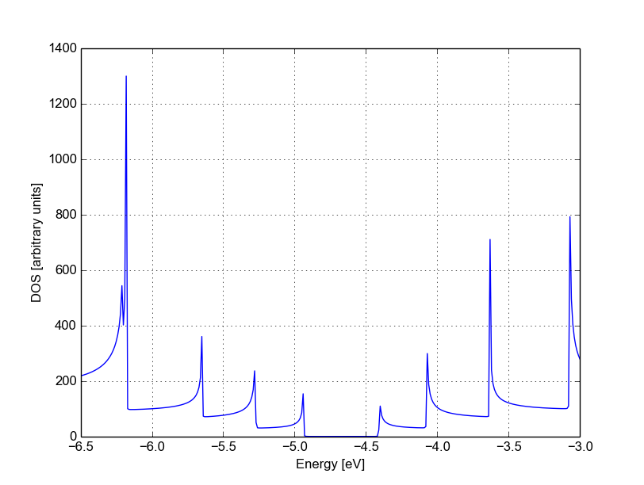

   Non-SCC density of states for a pristine AGR

You can plot the transmission or the density of states on a semi-logarithmic
scale::

  plotxy --xlabel 'Energy [eV]' --ylabel 'Transmission' -L \
  --xlimits -6.5 -3 --logscale y localDOS.dat

If you do so, you will obtain the plot shown in Figure
:ref:`fig_transport_carbon2d-trans_nonscc-dos-semilog`.

.. _fig_transport_carbon2d-trans_nonscc-dos-semilog:
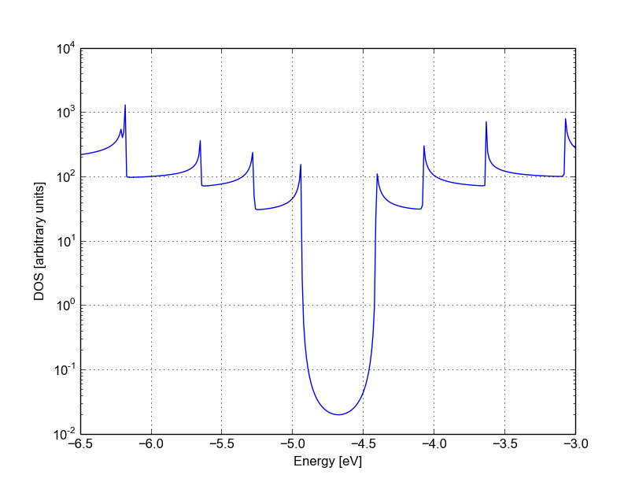

   Non-SCC density of states on logarithmic scale

The density of states inside the band-gap is not zero, but decreases by several
orders of magnitude. This is a natural consequence of the quasi-particle nature
of the Green's function formalism: every state in the system has a finite
broadening in energy.

Non-SCC armchair nanoribbon with vacancy (A)
============================================

[Input: `recipes/transport/carbon2d-trans/agr-nonscc/vacancy1/`]

Transmission and Density of States
----------------------------------

Now that we have a calculation of the reference pristine system, we will
introduce a scattering centre by producing a vacancy in the system. In order to
do so, we directly modify the structure file `device_7.gen` and the input file
`dftb_in.hsd`. We remove atom number 48 from the structure file. Note that DFTB+
ignores the indexes in the first column of the .gen file, therefore we do not
need to adjust them. We have, however, to remember to change the total number of
atoms in the first line from 408 to 407::

  407  C
  C    H
  1    1     37.831463060000    -20.000000000000      0.710000000000
  2    1     39.061219140000    -20.000000000000      1.420000000000
  3    1     39.061219140000    -20.000000000000      2.840000000000
  .....
  46    1     32.912438770000    -20.000000000000      7.810000000000
  47    1     30.452926620000    -20.000000000000      4.970000000000
  49    1     31.682682700000    -20.000000000000      7.100000000000
  50    1     30.452926620000    -20.000000000000      7.810000000000
  ...

The resulting structure should look like this:

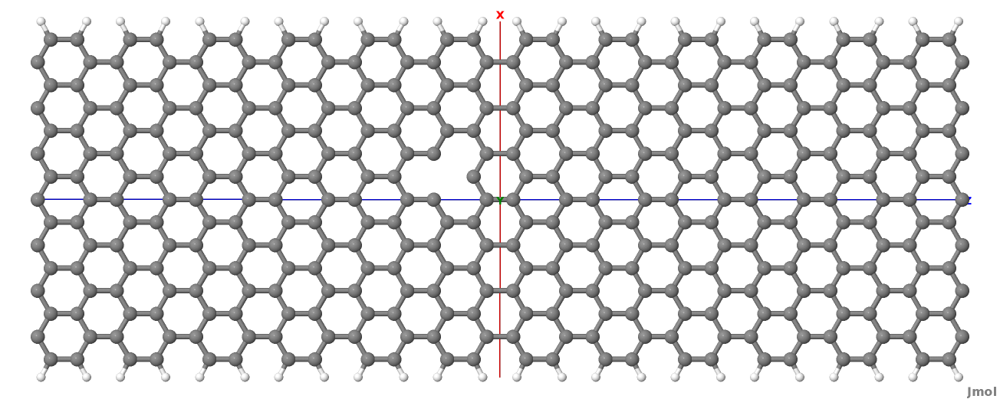

   Geometry with vacancy on sublattice A

We then also adjust the dftb_in.hsd file accordingly. As we have removed an
atom, all the indexes in the transport block need to be adjusted properly. Note
that we removed an atom in the first PL of the extended device, therefore we
also need to adjust the values of FirstLayerAtoms. The ``Transport`` block now
reads::

  Transport {
      Device {
        AtomRange = 1 135
        FirstLayerAtoms =  1 68
      }
      Contact {
        Id = "source"
        AtomRange = 136 271
        FermiLevel [eV] = -4.7103
        potential [eV] = 0.0
      }
      Contact {
        Id = "drain"
        AtomRange = 272 407
        FermiLevel [eV] = -4.7103
        potential [eV] = 0.0
      }
  }

Compared to the pristine system, we have modified ``AtomRange`` in all the
blocks and the values of ``FirstLayerAtoms``.

After running the calculation, we can compare the transmission curve for this
structure with a single vacancy and the pristine ribbon by using plotxy::

  plotxy --xlabel 'Energy [eV]' --ylabel 'Transmission' -L --xlimits -6.5 -3 \
  transmission.dat ../ideal/transmission.dat

.. _fig_transport_carbon2d-trans_nonscc-vac-tunn:
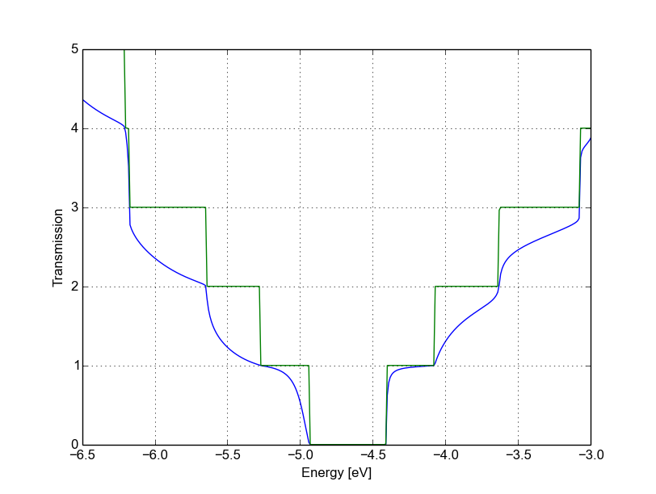
         ribbon

   Non-SCC Transmission in pristine (green) and single vacancy (blue) ribbons

Clearly, the presence of a vacancy introduces some finite scattering which
reduce the transmission with respect to the ideal ribbon.  In particular, the
effect is quite small in the first conductance band while it is more visible in
the first valence band and in higher bands.  The reflection amplitude is
increased near the band edges. This is expected in 1D systems, as near the band
edges the density of states diverges (Van Hove singularities), hence the group
velocity is lower, and it is known from semi-classical transport theory that the
scattering probability is, when short range disorder is present, inversely
proportional to the group velocity. The absence of resonant features in the
transmission may point to the fact that the vacancy does not induce additional
states in the conduction or valence bands. This can be verified by visualising
the density of states, as in Figure
:ref:`fig_transport_carbon2d-trans_nonscc-vac-dos`.

.. _fig_transport_carbon2d-trans_nonscc-vac-dos:
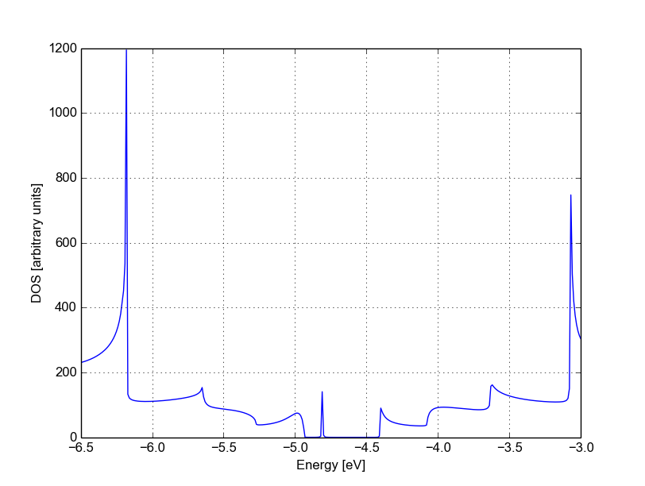

   Non-SCC DOS for single vacancy in sublattice A (linear scale)

The same density of states can be visualised on logarithmic scale as well, as in
:numref:`fig_transport_carbon2d-trans_nonscc-vac-semilog-dos`.

.. _fig_transport_carbon2d-trans_nonscc-vac-semilog-dos:
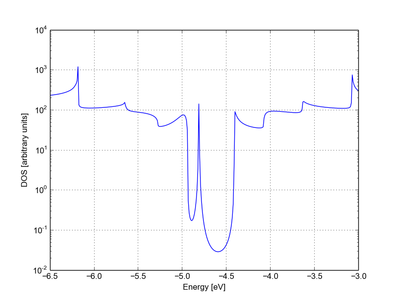

   Non-SCC DOS for single vacancy on sublattice A (semilog scale)

The vacancy is adding some close energy levels in the gap, as verified already
using a conventional DFTB+ calculation (:ref:`defect-electronic-states`). The
Van Hove singularities are partially suppressed as the system no longer
possesses translational symmetry along the transport direction. Even in a simple
non-SCC approximation, the qualitative picture is consistent with the previous
SCC periodic calculation. We will now consider a vacancy sitting on the other
sublattice (B) and try to understand whether the relative position of the
vacancy is relevant or not by calculating once more the non-SCC transmission and
density of states.

Non-SCC armchair nanoribbon with vacancy (B)
============================================

[Input: `recipes/transport/carbon2d-trans/agr-nonscc/vacancy2/`]

Transmission and Density of States
-----------------------------------

We will now consider a vacancy sitting on the other sublattice (B), i.e. we can
take the structure file we used for the ideal ribbon and instead delete the atom
number 47. The structure file is::

  407  C
  C    H
  1    1     37.831463060000    -20.000000000000      0.710000000000
  2    1     39.061219140000    -20.000000000000      1.420000000000
  3    1     39.061219140000    -20.000000000000      2.840000000000
  .....
  46    1     32.912438770000    -20.000000000000      7.810000000000
  48    1     31.682682700000    -20.000000000000      5.680000000000
  49    1     31.682682700000    -20.000000000000      7.100000000000
  50    1     30.452926620000    -20.000000000000      7.810000000000
  .....

The `jmol` rendering of the geometry:

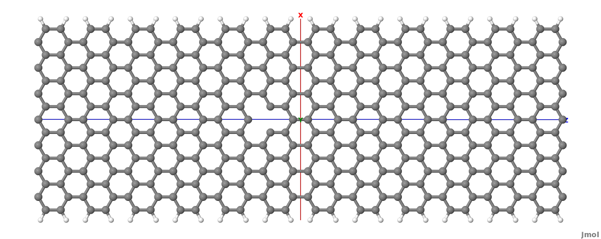

   Geometry with vacancy on sublattice B

Also in this case we remove an atom from the first PL of the extended device
region, therefore the rest of the `dftb_in.hsd` input file is identical to the
one we used for the vacancy on sublattice A. We can therefore just copy it and
run the DFTB calculation. The transmission is shown in Figure
:ref:`fig_transport_carbon2d-trans_nonscc-vac2-tunn` (transmission for vacancy
on sublattice B in blue, transmission for vacancy on sublattice A in green and
pristine system in green):

.. _fig_transport_carbon2d-trans_nonscc-vac2-tunn:
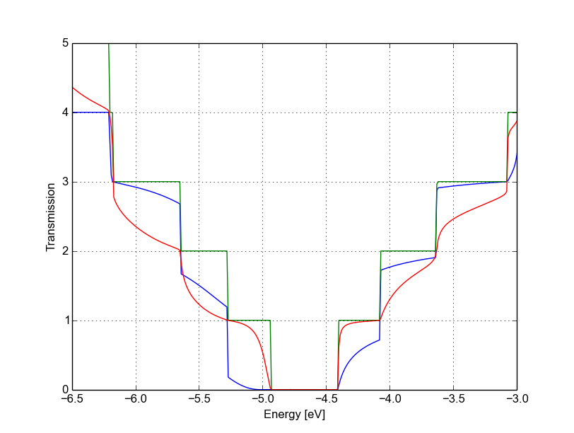
         A (green)

   Non-SCC Transmission for vacancy B (blue), pristine (green) and vacancy A
   (green)

We can see a very strong suppression of transmission in the first sub-bands,
especially in the first valence band. Again, the absence of resonances may be
due by gap states. In fact, we can verify it by plotting the density of states,
as shown in :numref:`fig_transport_carbon2d-trans_nonscc-vac2-dos`.

.. _fig_transport_carbon2d-trans_nonscc-vac2-dos:
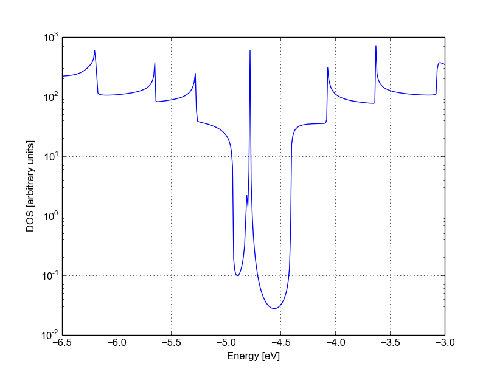

   Non-SCC DOS for vacancy in sublattice B

We can clearly see that the vacancy induces some nearly degenerate gap states,
and that the density of states at higher energies is largely unaffected. It is
known that the relative position of a scattering centre in a graphene nanoribbon
with respect to different sub-lattices strongly affects its transport
properties, as is shown in these non-SCC calculation. Qualitatively, the picture
is also consistent with periodic DFTB+ calculations, with the difference that we
directly obtain information on the effect on transport properties via
transmission function. This also ensures that we do not have to worry about
choosing the right supercell or k-point sampling as the open boundary conditions
represent exactly the infinite system with a single scattering centre. As
already pointed out earlier, there is no warranty that a non-SCC calculation
will give the proper result in a system if relevant charge transfer is
occurring, and in general it will not. Therefore in the next section we will
repeat the same calculation by solving the SCC problem.

SCC Pristine armchair nanoribbon
================================

A DFTB Hamiltonian is in general given by two terms:

.. math::
    H^{SCC} = H^{0} + H^{\text{shift}}

Where the component :math:`H^{\text{shift}}` is the self-consistent (SCC)
correction. The SCC correction is in general needed whenever there is a finite
charge transfer between atoms, i.e. whenever there are bonds between atoms with
different chemical species or with different coordination numbers. In our case,
we can expect a finite charge transfer between the C and H atoms at the edges,
and an SCC component may be relevant due to this charge transfer. While in the
previous sections, we have only considered the non-SCC component :math:`H^{0}`,
in the next sections we will compute the same calculation by including the
correction given by the shifts :math:`H^{\text{shift}}`.

Note that the equilibrium SCC problem can be tackled in two ways: we could apply
the Landauer-Caroli to an SCC Hamiltonian taken, for example, from a periodic
calculation (i.e. uploading the SCC component), or we can solve the problem as a
full NEGF setup with 0 bias. The code flow is currently such that this second
procedure has to be used (however, the first technique will be available in
future release). Therefore we will need to learn to set up the input related to
two other components of the NEGF machinery: the real space Poisson solver and
the Green's function solution of the density matrix.

In this way we will introduce a first complete input file. It is important, from
a didactic point of view, to be clear that as long as the applied bias is zero
and we are interested in equilibrium properties, the two approaches are
equivalent and the results are only valid in the limit of linear response.

Contact calculation
-------------------

[Input: `recipes/transport/carbon2d-trans/agr-scc/contacts/`]

In order to run an SCC transport calculation, the code needs some additional
knowledge about the contact PLs. In particular, the SCC shifts and Mulliken
charges have to be saved somewhere to enable consistency between the calculation
of the self-energy and the calculation of the Poisson potential. To this end, we
have to introduce an additional step in the procedure: the contact calculation.

The contact calculation is simply a periodic calculation for the contact PL. As
such, not all the field defined in the transport are meaningful and the input
file will of course look different. The ``Geometry`` block is identical::

  Geometry = GenFormat {
  <<< 'device_7.gen'
  }

While the ``Transport`` block needs to be modified as follows::

  Transport {
      Device {
        AtomRange = 1 136
      }
      Contact {
        Id = "source"
        AtomRange = 137 272
      }
      Contact {
        Id = "drain"
        AtomRange = 273 408
      }
    Task = ContactHamiltonian {
       ContactId = "source"
    }
  }

We first notice the addition of an option ``Task =ContactHamiltonian {...}``,
which was previously absent. This block specifies that we intend to calculate
the bulk contact SCC properties, and the field ``ContactId`` specifies which
contact we want to calculate. The field ``FirstLayerAtoms`` in the ``Device``
block is absent (it does not make sense in a contact calculation) and so are the
fields ``FermiLevel`` and ``Potential`` in the two ``Contact`` sections, as they
are not meaningful during this step. In general, the philosophy of a DFTB+ input
file is that if input fields that would be useless or contradictory are present,
the code will halt with an error message.

The Hamiltonian block shows some differences, too::

  Hamiltonian = DFTB {
    SCC = Yes
    SCCTolerance = 1e-6
    EwaldParameter = 0.1
    MaxAngularMomentum {
      C = "p"
      H = "s"
    }

    SlaterKosterFiles = Type2FileNames {
      Prefix = "../../slako/"
      Separator = "-"
      Suffix = ".skf"
    }

    KPointsAndWeights = SupercellFolding {
      25 0 0
      0 1 0
      0 0 1
      0.0 0.0 0.0
    }
  }

The flags ``SCC = Yes`` and ``SCCTolerance = 1e-6`` enable the SCC calculation.
A tight tolerance in the contact calculation, and in general in transport
calculations, helps to avoid artificial mismatches at device/contact boundaries.
The other parameters are the usual ones, except for the ``KPointsAndWeights``,
which deserves special attention.

The bulk contact is of course a periodic structure, hence we need to specify a
proper k-point sampling, as we would do in a regular periodic DFTB
calculation. However, you should be careful about the way the lattice vector is
internally defined. When the input system is a **cluster** (C), i.e. *it has no
periodicity in directions transverse to the transport direction(s)*, the lattice
vector of the contact is internally reconstructed and assigned to be the
**first** lattice vector, *regardless the spatial orientation of the
structure*. This means that the ``KPointsAndWeights`` for a cluster system are
always defined as above: a finite number of k-points along the first reciprocal
vector (according to a 1D Monkhorst-Pack scheme) and sampling with values of 0
along the other two directions. The reason for this choice is that we do not
want to assign a specific direction to the structures, i.e. at this level we do
not assume in any way that the structure must be oriented along x,y or z
direction.

Note also that as the contact information is used in the transport calculation,
it is a good idea to use a dense k point sampling and a low SCC tolerance, in
order to get a very well converged solution. The contact calculation will be
usually much faster than the transport calculation, so this does not usually
present a problem.

On the other hand, this rule regarding k-points does not apply to periodic
transport calculations, as the periodicity along the transverse directions must
also be preserved (refer to the following section for a periodic system
example). We can run the calculation by typing::

  dftb+ dftb_in.hsd | tee output.log

After running the calculation, we notice that a file `shiftcont_source.dat` is
generated. This file contains the information useful for the transport
calculation (shifts and charges of a bulk contact). It is suggested you also
keep a copy of the `detailed.out` for later reference. We can obtain the value
of the Fermi energy, which we will later need, from `detailed.out` as -4.7103 eV
(this is also stored in the "shiftcont_*.dat" files).

We can now run the same calculation for the drain contact by just modifying the
``Task`` block::

  Task = ContactHamiltonian {
       ContactId = "drain"
    }

The contact are identical, therefore we expect the same results, also with the
same Fermi energy. We now have a file `shiftcont_drain.out`, which is equivalent
to `shiftcont_drain.dat` apart from small numerical error. In fact, we could
have simply copied the previous contact results into this file.

Now that the contact calculation is available, we can set up the transport
calculation.

Transmission and Density of States
----------------------------------

[Input: `recipes/transport/carbon2d-trans/agr-scc/ideal/`]

In order to calculate the transmission for the SCC system, we have to copy the
files `shiftcont_drain.dat` and `shiftcont_source.dat` into the current
directory::

  cp ../contacts/shiftcont* .

Then we have to specify some additional blocks with respect to a non-SCC
transport calculation. We first look at the ``Transport`` block itself::

  Transport {
    Device {
      AtomRange = 1 136
      FirstLayerAtoms =  1 69
    }
    Contact {
      Id = "source"
      AtomRange = 137 272
      FermiLevel [eV] = -4.45
      potential [eV] = 0.0
    }
    Contact {
      Id = "drain"
      AtomRange = 273 408
      FermiLevel [eV] = -4.45
      potential [eV] = 0.0
    }
    Task = UploadContacts {
    }
  }

The atom indices are of course the same, as the geometry of the system is not
changed. This time though, we explicitly specified a ``Task`` block named
``UploadContacts``, which declares that we are now running a full transport
calculation. ``Task = UploadContacts {}`` is the default and does not take any
additional parameters, therefore you can safely omit it.

Now that we are solving the full SCC scheme, we will allow for charge transfer
between the open leads and the extended device region, therefore it is important
to set a well-defined Fermi energy. While this does not make any difference in a
non-SCC transmission calculation, it is crucial for the SCC calculation. A wrong
or unphysical Fermi energy will lead to incorrect charge accumulation or
depletion of the system.

To this end, you will have to pay some attention to the definition of the Fermi
energy. As we are calculating a semiconductor system, the Fermi level should be
in the energy gap. By calculating a band structure or by inspection of the
eigenvalues in the file `detailed.out` you can verify that the value -4.7103 is
on the edge of the valence band. This can be explained as numerically the Fermi
level is defined by filling the single particle states till the reference
density is reached. Its position inside the gap of a semiconductor is in some
senses arbitrary within that range (a common convention which DFTB+ uses is to
set it at the middle of the gap). Therefore, while in metallic system we may
ensure consistency and use a well converged Fermi level at some specific
temperature during all our transport calculation, in the case of a semiconductor
system we can manually set the Fermi level in the middle of the energy gap (for
this system, roughly at -4.45 eV) and freely vary the temperature as long as the
gap is larger than several times the value of kT.

We will see in the following that there are some ways to verify that the Fermi
level is defined consistently, as this is often source of confusion. Note also
that, differently from other codes, DFTB+ allows for different Fermi levels in
different contacts, which can be useful when heterogeneous contacts are defined
(for example, in a PN junction). In that case a built-in potential is internally
added to ensure no current flow at equilibrium.

In the ``Hamiltonian`` block now an SCC calculation has to be specified::

  Hamiltonian = DFTB {
    SCC = Yes
    SCCTolerance = 1e-6
    ReadInitialCharges = No
    ...

Poisson Solver
--------------

Differently from the non-SCC calculation, we now need to specify a way to solve
the Hartree potential and the charge density self-consistently. In a NEGF
calculation, we use a real-space Poisson solver to calculate the potential, and
a Green function integration method to calculate the density matrix::

  ...
  Electrostatics = Poisson {
    PoissonBox [Angstrom] = 40.0 30.0 30.0
    MinimalGrid [Angstrom] = 0.5 0.5 0.5
    SavePotential = Yes
  }

The Poisson section contains the definition of the real space grid
parameters. Note that differently from a normal DFTB+ calculation, simulating
regions of vacuum is not for free, as the simulation domain must be spanned by
the real space grid. The grid is always oriented along the orthogonal cartesian
coordinate system. ``PoissonBox`` specifies the lateral length of the grid. The
length along the transport direction is ignored as it is automatically
determined by the code (in this case, z=30.0). The length along the transverse
direction are relevant and *should be carefully set*. In order not to force
unphysical boundary conditions, you may extend the grid at least 1 nm away. If a
strong charge transfer is present, you may go for a larger box, according to
your available computational resources. A poorly defined grid can lead to no
convergence at all, to a very strange (and slow) convergence path or to
unphysical results. ``MinimalGrid`` specifies the minimum step size for the
multigrid algorithm. Values between 0.2 and 0.5 are usually good, where a lower
value stands for higher precision. ``SavePotential = Yes`` will return a file
containing the potential and charge density profile, for later reference. These
files can be quite large, therefore the default is ``No``.

Density Matrix Calculations - GreensFunction solver
---------------------------------------------------

The Eigensolver is now specified as ``GreensFunction``. With this definition, we
instruct the code not to solve an eigenvalue problem but rather to calculate the
density matrix by integration of the Keldysh Green function::

  Eigensolver = GreensFunction{}

This block provides the SCC charge density with or without applied bias. The options define the
integration path. Usually the default options are good enough in most cases and
advanced users may refer to the manual or other examples in this book.

The ``Mixer`` options is present in DFTB+ calculations as well.::
  
   Mixer = Broyden {
     MixingParameter = 0.02
   }

Convergence is known to be critical in NEGF schemes. In that case, a low ``MixingParameter``
value will help to avoid strong oscillation in the SCC iterations.

The last block is ``Analysis``::

  Analysis {
    TunnelingAndDos {
      Verbosity = 101
      EnergyRange [eV] = -6.0  -3.0
      EnergyStep [eV] = 0.01
    }
  }

This block is identical to the non-SCC calculation as the same task is
performed: calculation of Transmission, current and DOS by using the
Landauer-Caroli formula. The Transmission will be of course be different due to
the fact that the ground state charge density is now solution of the SCC
Hamiltonian and we have slightly changed the energy range as the SCC component
introduce a shift of the band-structure (try to compare the SCC and non-SCC
transmission results when you are done). We can now run the calculation::

  mpirun -n 4 dftb dftb_in.hsd | tee output.log

Where ``-n 4`` should be adapted to the number of available nodes. As transport
calculations in DFTB+ are parallelised on energy points, a quantity larger than
40 (the default number of integration points at equilibrium) will not speed up
the calculation of the density matrix.

An inspection of the file `detailed.out` reveals that we have additional
information with respect to the non-SCC calculation, including a list of atomic
charges and orbital population, as now the SCC density matrix has been
calculated. The transmission is also saved as separate file, and is shown in
:numref:`fig_transport_carbon2d-trans_scc-tunn`.

.. _fig_transport_carbon2d-trans_scc-tunn:
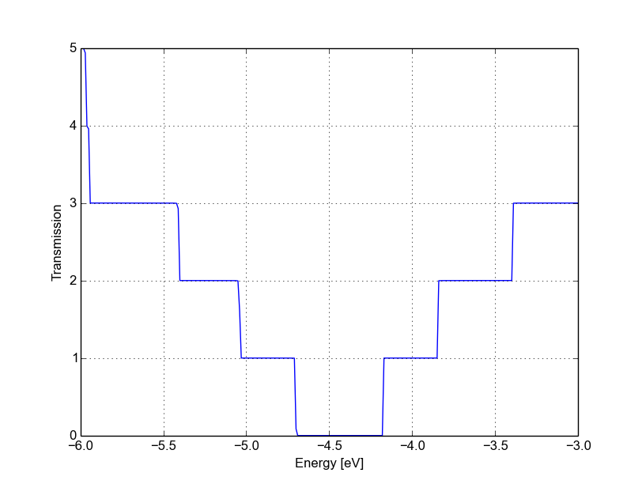

   SCC transmission in pristine AGR

As you would expect, it still step-like as in the non-SCC calculation. This is
correct, as we're calculating an ideal 1D system. The bandwidth (i.e., the steps
width) may differ due to SCC contribution and the overall transmission is
shifted. Note that while the non-SCC calculation is very robust, meaning that
you will always get step-like transmission for a 1D system, in the SCC
calculation a poor definition of the boundary conditions, of the bulk contact
properties or of the additional ``GreensFunction`` and ``Poisson`` blocks may
induce numerical artefacts and scattering barriers which should not be there. As
a result, the transmission will not appear step-like but rather visibly smoothed
out.

You can also verify the quality of the calculation by inspection of the
potential and charge density profiles. In a pristine periodic system we would
expect a periodic potential, without discontinuities at the boundary between
extended device and electrodes. The information needed to construct the real
space potential and charge density are contained in 5 files: `box3d.dat`,
`Xvector.dat`, `Yvector,dat`, `Zvector.dat`, `potential.dat` and
`charge_density.dat`. The first 4 files contain the grid information, and the
last two ones the list of potential and charge density values (following a row
major order). Those information can be converted to any useful with some simple
scripting, we provide an utility called `makecube` which can be used to convert
them to Gaussian `cube` format or a more flexible `vtk` format. There's plenty
of software to visualise `vtk` or `cube` files, but unluckily at present current
choices of software which are effective at visualising real space grid data are
weak at visualising atomistic structures, and vice versa. In the following we
will use `paraview` and work with the `vtk` format. `Paraview
<http://www.paraview.org>`_ is freely available and is supplied with many
gnu/linux distributions as a compiled package.

The `vtk` file can be obtained by simply running::

  makecube potential.dat pot.vtk

.. _fig_transport_carbon2d-trans_clip-pot:
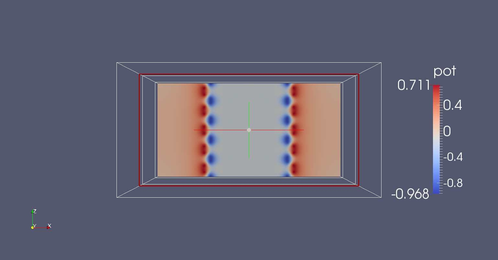

   Potential profile along the nanoribbon

An extensive explanation of `paraview` features is beyond the scope of this
tutorial. Following some easy steps, you can produce the potential map shown in
:numref:`fig_transport_carbon2d-trans_clip-pot`.

1. Open paraview and import the file `pot.vtk` from File->Open
2. Click on Properties->Apply (Properties are usually visualised on the left
   side of the screen) and you should see the bounding box in the visualisation
   windows.
3. In the Pipeline browser select the file `pot.vtk` by clicking once on it, and
   then select the Clip filter from Filters->Alphabetical (or from the filter
   toolbar).
4. In Properties, click on 'Y Normal' to produce a clip along the nanoribbon.
5. Click on Properties->Apply.

The plot shown in :numref:`fig_transport_carbon2d-trans_clip-pot` above is
the self-consistent potential along the nanoribbon. We can see that the charge
transfer between carbon and hydrogen at the edges results in a non-flat
potential. At a first glance, the potential looks quite homogeneous, meaning
that there are no clear discontinuities at the box boundary. This is important:
being it a homogeneous ribbon, the potential should have the same periodicity as
the lattice. We can verify this with a closer inspection by plotting a cut along
a line. We apply the following steps:

1. We select `pot.vtk` in the Pipeline Browser and Filters->Alphabetical->Plot
   Over Line
2. From the Properties window, we select 'Z Axis' and click on 'Apply'

By following this procedure we obtain Figure
:ref:`fig_transport_carbon2d-trans_plotline-pot`.

.. _fig_transport_carbon2d-trans_plotline-pot:
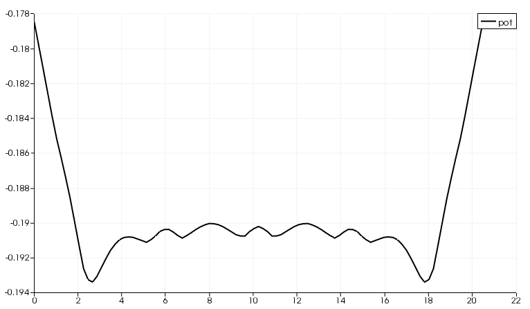

   Potential profile along the nanoribbon

As you can notice, there is a discontinuity at the interface. However, it is
quite small (~ 12 meV). Defining a 'perfect' interface between the bulk
semi-infinite contacts and the device region is very difficult, especially in a
semiconductor where no free charge can contribute to screen such an interface
potential. A smaller tolerance in the self-consistent charge during the contact
and the device calculation, a finer calculation of the Fermi level (in metallic
systems) and a finer Poisson grid can decrease the discontinuity: you should be
able to reach about 1 meV, but it is difficult to go below this value. However,
as you can see in the transmission plot, as long as the discontinuity is this
small, it hardly affects the transmission.

However, it is important for you to verify that the behaviour at the boundaries
is reasonable. Otherwise, the extended region may be too small to allow to the
relevant physical quantities (charge, potential) to relax to bulk values. Be
aware that numerical errors are unavoidable, therefore it is important to
understand their relevance and the impact on the results. In the transmission
calculation we do not notice anything different because the energy step is close
to the mismatch at the boundaries.

After running the calculation for the pristine system, we will introduce
vacancies as we did in the non-SCC calculation. The results should be now
directly comparable to the bulk periodic SCC  calculation.

SCC armchair nanoribbon with vacancy (A)
========================================

[Input: `recipes/transport/carbon2d-trans/agr-scc/vacancy1/`]

We will now calculate the SCC transmission for the nanoribbon with a vacancy on
the sublattice A, using the same input structure set up for the non-SCC
calculation. The contacts are identical to the pristine case, therefore in the
following we will only modify the extended device calculation.

Transmission and Density of States
-----------------------------------

As previously done, the transport section must be modified in order to account
for the different number of atoms in the extended device region::

  Transport {
      Device {
        AtomRange = 1 135
        FirstLayerAtoms =  1 68
      }
      Contact {
        Id = "source"
        AtomRange = 136 271
        FermiLevel [eV] = -4.45
        potential [eV] = 0.0
      }
      Contact {
        Id = "drain"
        AtomRange = 272 407
        FermiLevel [eV] = -4.45
        potential [eV] = 0.0
      }
    Task = UploadContacts {
    }
  }

We use the same Fermi level and the files `shiftcont_source.dat` and
`shiftcont_drain.dat` as in the pristine system calculation, as the contacts are
not modified.

The ``Hamiltonian`` block is also not modified, except for an additional finite
temperature::

  Hamiltonian = DFTB {
    ...
    Filling = Fermi {
      Temperature [Kelvin] = 150.0
    }
    ...
  }

A finite temperature is used to provide a finite temperature broadening, useful
if the vacancy induces partially filled gap states. In general, temperature
broadening may improve convergence and dump oscillations in the SCC iterations.

The ``Analysis`` block is also similar, we add the DOS calculation to verify if
we can identify a vacancy state::

  Analysis {
    TunnelingAndDos {
      Verbosity = 101
      EnergyRange [eV] = -6.0  -3.0
      EnergyStep [eV] = 0.025
      Region {
        Atoms = 1:135
      }
    }
  }

As usual, you can now create the `GS` and `contacts` directories, copy the
`shiftcont_source.dat` and `shiftcont_drain.dat` in the current directory and
run the calculation.  The density of states and transmission are shown in Figure
:ref:`fig_transport_carbon2d-trans_scc-vac-dos` and
:ref:`fig_transport_carbon2d-trans_scc-vac-tunn`.

.. _fig_transport_carbon2d-trans_scc-vac-dos:
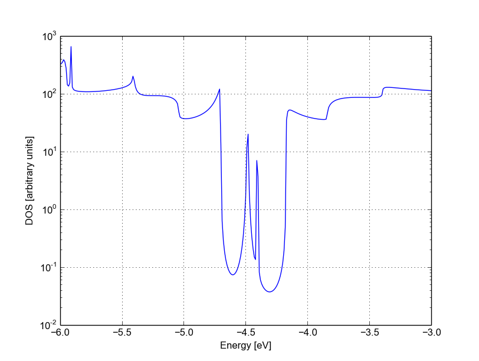

   Density of states for vacancy (A)

.. _fig_transport_carbon2d-trans_scc-vac-tunn:
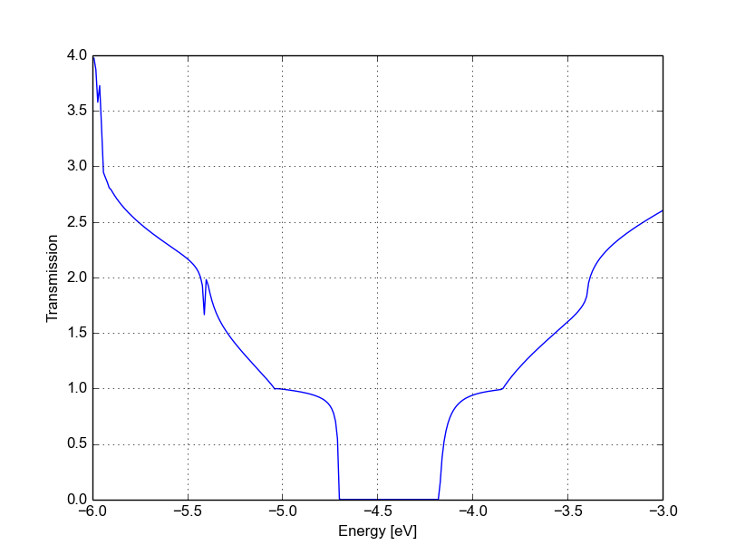

   Transmission for vacancy (A)

The vacancy states are located in the energy gap, consistently with the periodic
calculation, and that the tunnelling curve is qualitative similar to the non-SCC
calculation. The first conduction and valence band are weakly affected by the
vacancy which does not act as a strong scatterer. There is no signature of
resonances, as the additional levels are located in the gap.

Note also that we previously recommended the use of large extended regions and
to verify that the potential and charge density are smooth at interfaces. As you
can see in :numref:`fig_transport_carbon2d-trans_clip-vac-pot`, the impurity
is very close to the boundaries, resulting to a potential profile which varies
significantly close in to the boundary. It is left to the reader to verify that
the overall transmission does not change significantly if a longer extended
region is considered.

.. _fig_transport_carbon2d-trans_clip-vac-pot:
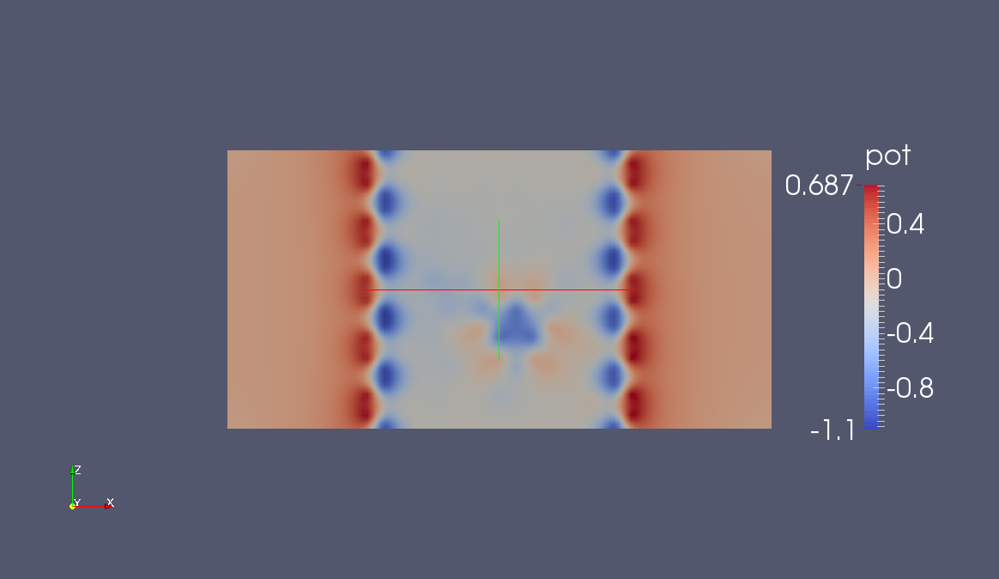

   Potential profile for vacancy (A)

SCC armchair nanoribbon with vacancy (B)
========================================

[Input: `recipes/transport/carbon2d-trans/agr-scc/vacancy2/`]

We will now run the same calculation, but with the vacancy on the
sublattice B. As in the non-SCC case, the only difference with the previous
calculation is the location of the vacancy, therefore the input file is
absolutely identical. The contacts are the same, therefore all we have to do is
copy the `shiftcont_source.dat` and `shiftcont_drain.dat` files into the current
directory and run the calculation.

The resulting transmission and density of states are shown in Figures
:ref:`fig_transport_carbon2d-trans_scc-vac2-dos` and
:ref:`fig_transport_carbon2d-trans_scc-vac2-tunn`.

.. _fig_transport_carbon2d-trans_scc-vac2-dos:
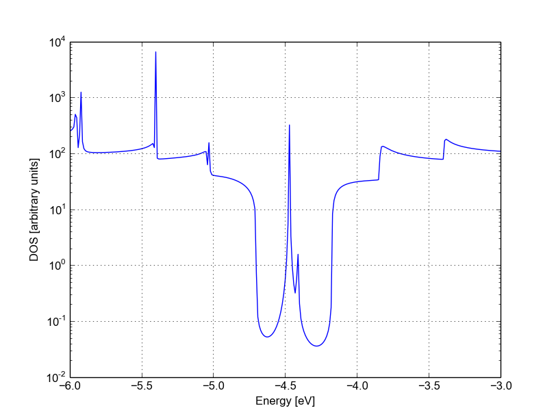

   Density of states for vacancy (B)

.. _fig_transport_carbon2d-trans_scc-vac2-tunn:
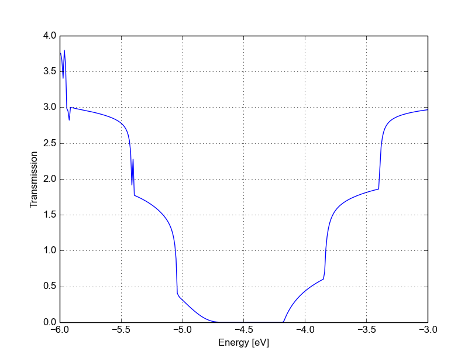

   Transmission for vacancy (B)

We immediately notice that the Van Hove singularities are strongly suppressed
and that the valence band is substantially suppressed. Consistently with the
picture obtained by periodic calculation, a quasi-bounded vacancy level
hybridises with the valence band edge causing strong back-scattering. A
comparison between all the three cases (see Figure
:ref:`fig_transport_carbon2d-trans_scc-tunn-comparison`) shows that the
scattering probability is strongly affected by the exact position of the
vacancy. This is generally true for other kinds of short range scattering
centres in graphene nanoribbons, such as substitutional impurities. We can also
notice that in this particular case the non-SCC approximation is qualitatively
consistent for two reasons: the vacancy levels are not populated and the charge
transfer at the edges is not critical as the edges contribute poorly to the
transmission in an armchair ribbon.

.. _fig_transport_carbon2d-trans_scc-tunn-comparison:
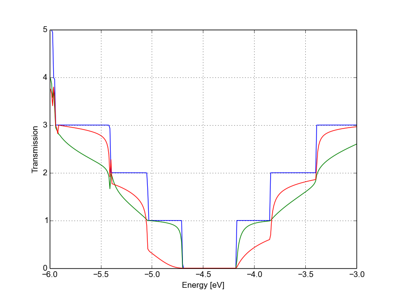
         vacancy (B) (red)

   Transmission for pristine system (blue), vacancy (A) (green) and vacancy (B)
   (red)
