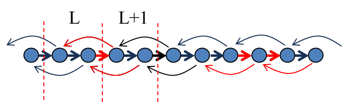
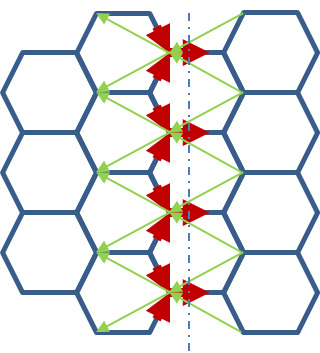
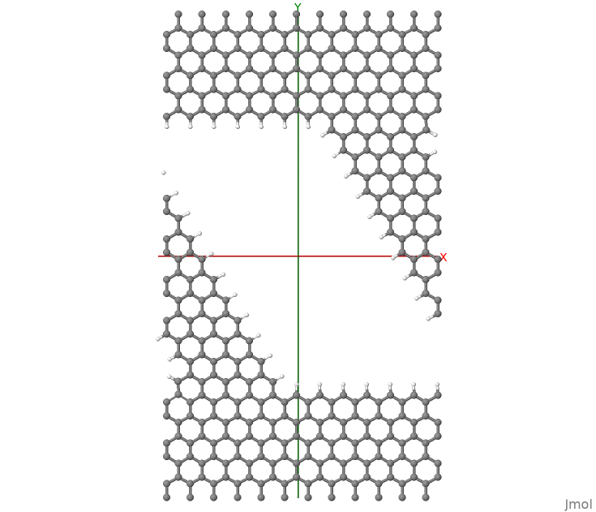
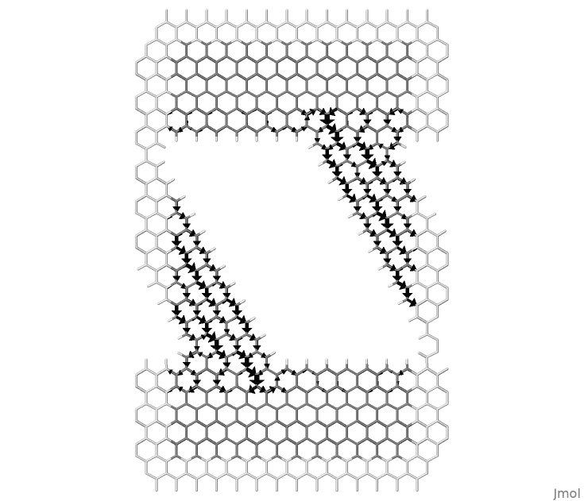
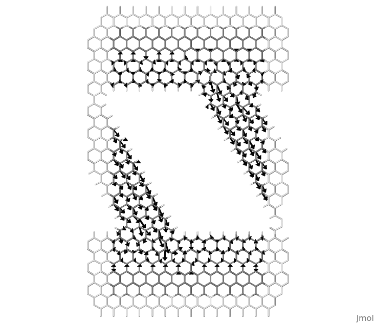

.. _example-localcurr:

Example: Local Currents 
=======================

[Input: `recipes/transport/local-currents/`]

This example guides the calculation of local atom-to-atom currents. DFTB+ can
compute atom-to-atom currents starting from the general expression for the layer
to layer current,

.. math:: J = \frac{2e}{\hbar} \text{Tr} \left[H_{L,L+1} \rho_{L+1,L} -
   S_{L,L+1} \varepsilon_{L+1,L} - h.c. \right]

where :math:`L` and :math:`L+1` are principal layers of the transport region,
:math:`\rho` is the density matrix, :math:`\varepsilon` is the energy-weighted
density matrix, and the trace operation is used to add up all
contributions. This expression is exact and guarantees current conservation
along the device.  From the above it is possible to write down an expression for
current contributions from atom :math:`i` to atom :math:`j` as,

.. math:: J_{ij} = \frac{2e}{\hbar} \sum_{\mu \in i} \sum_{\nu \in j} \text{Im}
   \left[ H_{\mu \nu} \rho_{\nu \mu} - S_{\mu \nu} \varepsilon_{\nu \mu}\right]

It should be pointed out that a derivation of the formula above is possible by,
for instance, considering the time derivative of atom-projected wavefunctions
but that leads to issues if the basis is not orthogonal (the DFTB case). Some
implementations of local currents perform a Lowdin transformation in order to
obtain orthogonalised local states to start, but we prefer to avoid such
transformations that imply diagonalisation of potentially large matrices, beside
the fact that with semi-infinite contacts the Lowdin rotation requires some
truncation. In any case the non-locality and degree of ambiguity is not fully
solved since Lowdin orbitals are quite extended.

The formulation we give still produces some issues the user should be aware
of. Consider for instance a current in a linear chain with second-neighbour
tight-binding interaction, as shown in
:numref:`fig_transport_local-currents_chain`

.. _fig_transport_local-currents_chain:

   Bond currents in a linear chain with 2nd neighbour interactions.

Surprisingly, in the limit of low biases the bond currents between nearest
neighbour atoms is positive, whereas the contribution from 2nd neighbour atoms
is in the opposite direction.  In units of quanta of conductance, we obtain
:math:`J = 1.2 \text{G}_0 V` between nearest-neighbour atoms and :math:`J =
-0.1 \text{G}_0 V` between second-neighbour atoms.  If we cut any surface across
the chain and compute the total current we correctly obtain :math:`J = 1.0
\text{G}_0 V`, i.e. a single quanta of conductance, as expected.  The right
panel of the figure above shows what happens when we compute atomic currents as
a summation over bond currents. Then, for each atomic site we have an outgoing
current flux of :math:`J = 1.2 - 0.1 = 1.1 \text{G}_0 V`. In the steady-state
this is balanced by an opposite ingoing flux. Yet the net outcome of the
calculation is a wrong conductance! What is missing is the 2nd neighbour
contributions bypassing the next neighbour atoms. Clearly in a 1-dimensional
chain this problem can be easily corrected, however in higher dimensional
systems the correction might not be trivial or possible.  Consider for instance
the case of graphene as shown in
:numref:`fig_transport_local-currents_graphene`,

.. _fig_transport_local-currents_graphene:

   Bond currents in a ideal graphene with 2nd neighbour interactions.

Similar to the linear chain, the 1st neighbour currents go along the bias
direction, whereas the 2nd neighbour currents point upstream. Clearly in general
the contribution of 2nd or higher neighbour bond currents on each atom are not
simple to include. Notice that the very same conceptual problem would occur also
when the Lowdin transform is performed.

In conclusion, the local-orbital approach to bond currents produces well-defined
quantities on the connection graph that however do not define a vector
field. Despite this it is still useful to look at them.  In the following example
we show the difference between atom current and bond currents.  In the second
case we only consider first neighbour contributions.  Atom currents on the other
hand are computed as a summation of all neighbour contributions and based on the
discussion above, they tend to produce a slightly overestimated result.

The reader might think that the easy solution to the problem could be to use the
atomic orbitals to project the bond currents onto a real-space grid in order to
recover a vector field. Unfortunately, this procedure produces strong violations
of current continuity unless a complete set of orbitals is used.  However the
usual atomic orbital basis sets are far from complete.

Nanoribbon example
^^^^^^^^^^^^^^^^^^

In order to obtain the local currents the user has to set the following input
block::

  EigenSolver = Greensfunction {
    localCurrents = Yes
  }

The reason why local currents are specified in the Greensfunction block and not
within the Analysis block (e.g., TunnelingAndDos), is because the evaluation of
local currents requires the Density Matrix and Energy-Weighted density matrix, according to
the equations above.  Hence all options concerning the contour integral apply to
these calculations, rather than the options concerning the transmission
function.  The structure considered is shown in
:numref:`fig_transport_local-currents_str`.

.. _fig_transport_local-currents_str:

     Nanoribbon considered in this tutorial. Periodic BC are used along X.

It consist of a nanoribbon in between graphene contacts. Periodic Boundary
Conditions have been applied along the x-axis. Dangling bonds have been
saturated with hydrogen atoms. In order to discuss the more complex case of
currents in periodic systems, we consider a graphene nanoribbon (GNR) with a
diagonal orientation.  The hydrogen atoms are found very important in order to
obtain a converged SCC-loop. Mulliken charges compare very well with values
obtained for a supercell calculation based on usual DFTB. In order to converge
the SCC loop we had to set a value for the delta-parameter in the Green's
function definition larger than the default value::

  EigenSolver = Greensfunction {
    delta = 5e-4
    localCurrents = Yes
  }

This might occasionally happen when the iterative decimation solver of the
surface Green's functions fails with inversion errors or unusually long
calculations that ends in NaN results.  In this tutorial converged charges are
precomputed and read from `charges.dat`.  Notice that the file is stored as
formatted text, hence the following option is required::

  Option{
    ReadChargesAsText = Yes
  }

The user might experiment restarting the SCC loop, this should take about 40 SCC
iterations to converge.

.. _fig_transport_local-currents_bond-currents:

     Local bond currents in a nanoribbon between graphene contacts.

:numref:`fig_transport_local-currents_bond-currents`, shows the bond
currents. This figure is obtained as a post-processing of the code outputs using
the small program `flux.f90`, which can be found in the folder
`tools/misc/transport/`.  DFTB+ produces the following output files::
  
   supercell.xyz
   lcurrents_001_u.dat
   lcurrents_u.dat

The file supercell.xyz contains the input geometry with additional atoms of the
neighbour cells that are used to calculate the bond directions and draw the
arrows. Notice that only bond-currents going from the central cell towards the
atoms in the periodic copies are computed. The figure can be made periodic by
copy-paste of repeating cells.  The second file contains the k-resolved local
currents, where 001 here stands for the first k-point and "u" stands for up
spin.  The last file contains the summation over all k-components with
corresponding weights.

Make sure the program flux.f90 has been compiled and is available. The figure
above was obtained by issuing the following command::

  >> flux supercell.xyz -b lcurrents_u.dat 3 -w 0.3 -f 1.0 > scr.jmol

Notice the value 3 used, representing the number of neighbours considered.  Then
it is possible to plot this with::

  >> jmol supercell.xyz -s scr.jmol

The white background colour in jmol was obtained with the jmol command::

  > background white
  > wireframe 0

and the black arrows can be obtained using the `-c black` as last option to
flux.
  
.. _fig_transport_local-currents_atom-currents:

     Local atomic currents in a nanoribbon between graphene contacts.
  
Similarly, it is possible to draw atomic currents shown in
:numref:`fig_transport_local-currents_atom-currents`, with the command::

  >> flux supercell.xyz -a lcurrents_u.dat 24 -w 0.3 -f 1.0 > scr.jmol

Here we consider 24 neighbours for every atom to reach a converged result.  The
user can experiment by changing this value as well as well as the value used for
bond currents.

The rendering of the local current as arrows in jmol is a little primitive.  One
difficulty is that a linear scale has a narrow window of values that can be
rendered with visible arrows. Arrows representing atomic currents are adjusted
in length. The option -f can be used as a global rescaling factor in order to
adjust all lengths by a factor.  The arrows representing bond currents are
limited within the bonds.  In this case, in order to emphasise different
magnitudes arrow widths are used.  These can be adjusted using the option -w. In
most cases it might be necessary to edit flux.f90 in order to adjust the
aesthetics of the rendering as desired.
