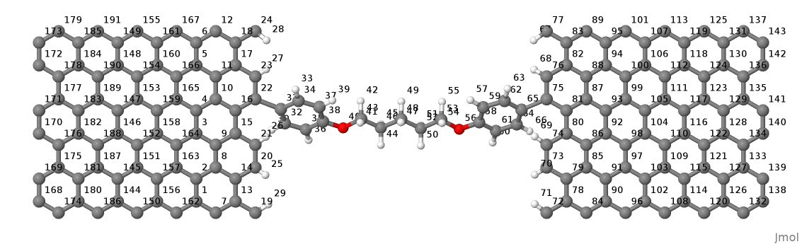
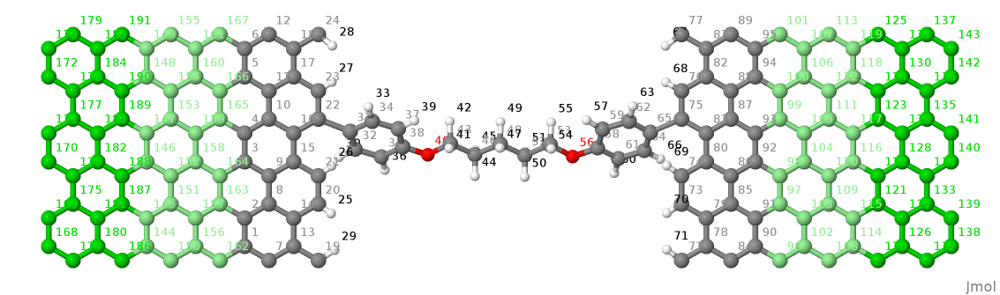
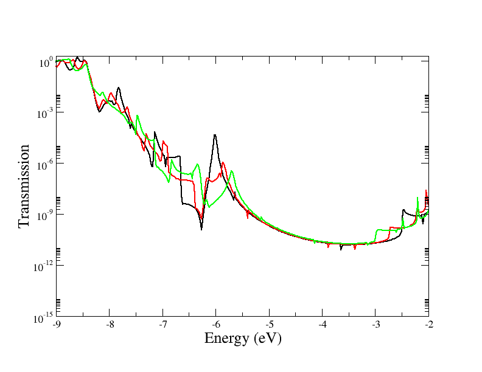

.. _example-molj:

.. raw:: latex

   \newpage

Example: Molecular Junction
===========================

This example guides in the definition of a contact/molecule/contact structure for 
transport calculations.

Tasks 0: Preparation of the structure
^^^^^^^^^^^^^^^^^^^^^^^^^^^^^^^^^^^^^

Before starting any calculation it is necessary to define the stucture following the rules 
given in the first section, ``Specifing Geometry``.
Here we give some tip in order to speed up the process. The following procedure is valid for 
systems with 2 contacts placed along the same transport direction. 
1. It is convenient to define a structure without paying attention to atom ordering.
The system should be complete, with each contact comprising two PLs.   
#. Once the structure has been prepared it is convenient to convert it to a simple xyz format
#. Reorder the atoms according to the coordinates along the transport direction.
In Linux this can be achieved using sort, e.g.,
``$ sort -n -k 2 input.xyz > output.xyz``
This will sort according to 'column #2', corresponding to the 'x' coordinates.
Even better, the following command line will skip the first two lines
``$ (head -2 input.xyz && tail -n +3 input.xyz | sort -nk 2) > output.xyz`` 
#. Check that, after sorting, the contacts comprise 2 PLs with exactly the same atomic ordering.
#. Open the sorted xyz structure with a text editor and move the first contact to the 
end of the structure. Reverse the order to the two PLs: the first PL must be closer to 
the device region. 
#. Reconvert back to gen format (xyz2gen) and add the supercell information, if present.

.. _fig_transport_junction-sorted:

     System with atoms sorted along the x-direction.
 
#. Now the system is ready for transport calculations. It is possible to define PLs also 
in the molecular region, quite useful to speed up calculations. 
The size of these PLs depends on the largest cutoff in the tight-binding interactions. 
Figure ``_fig_transport_junction-sort-col`` shows an example of PLs highlighted in different colors.

.. _fig_transport_junction-col:

     System showing the PLs highlighted in colors.
 
#. Relaxation of the structure. 
Only the molecular atoms were allowed to move, namely the first 95 atoms. 
The contacts must be kept fixed, otherwise the definition of the two PLs, as rigid shifted 
copies of each other will be lost. 
It is a good idea to build the contact PLs from previously relaxed bulk structures.
The structure was a bit difficult to relax at first since the SCC-loop did not converge. 
In such cases it is better to proceed in different relaxation steps. 
i) Initially the structure was relaxed with a non-SCC calculation and just Gamma point.
ii) More points where added in the direction y, parallel to transport.
iii) SCC was finally switched on. 
In order to help convergence and avoid electrostatic artefacts the dangling bonds at both 
contact ends have been saturated with hydrogens. In other cases, if the system allows, it 
is possible to make it periodic in along the transport direction. 
It is possible to relax under open boundary conditions but this can be left as a final 
refinement step.

Task 1: Calculation of the contacts
^^^^^^^^^^^^^^^^^^^^^^^^^^^^^^^^^^^ 

In the input file you need to specify the Geometry and Transport blocks for the
contact calculations tasks::

  Geometry = GenFormat {
  <<< str.gen'
  }

  Transport {
    Device {
      AtomRange = 1 95
    }
    Contact {
      Id = "source"
      AtomRange = 96 143
      PLShiftTolerance = 0.01
    }
    Contact {
      Id = "drain"
      AtomRange = 144 191
      PLShiftTolerance = 0.01
    }
    Task = ContactHamiltonian{
       ContactId = "source"
    }
  }

Notice the tag ``PLShiftTolerance`` added here since in this case the 2 contact PLs are not 
**strictly** rigid copies of each other. It is possible to comment out the tag and see the 
error message from dftb+.
With task ``ContactHamiltonian`` dftb+ perform a contact calculation. 
The code extracts from the complete device geometry the
contact defined with ``Id = "source"`` and constructs adequate supercell
vectors from the coordinates given in the two PLs. 
The remaining input file refers to a standard DFTB+ calculation of a supercell system 
for which an appropriate k-point sampling must be specified::

  Hamiltonian = DFTB {
    SCC = Yes 
    MaxAngularMomentum {
      C = "p"
      O = "p"
      H = "s"
    }

    SlaterKosterFiles = Type2FileNames{
      Prefix = "./mio-1-1/"
      Separator = "-"
      Suffix = ".skf"
    }

    Filling = Fermi{
      Temperature [Kelvin] = 0.0
    }

    KpointsAndWeights = SupercellFolding {
       16  0   0
       0   16  0
       0   0   1
       0.0 0.0 0.0
    }

    Electrostatics = GammaFunctional {}
    Eigensolver = DivideAndConquer {} 
  }

.. _sec_contact_supercell:

Contact supercell
^^^^^^^^^^^^^^^^^

Since the input geometry is defined as a Supercell, dftb+ preserves the meaningful
supercell vectors. In this case the transport direction is along x and the relevant
periodicity is along the lateral direciton, y. 
The supercell vector along x is completely dummy, whereas periodicity along z defines 
the graphene-graphene separation. This value **does matter** in the definition of the 
Poisson Box (see below), so it cannot be made arbitrarily large.
The code internally builds a supercell vector for the contact along the x-direction, taken
from the geometry definition of the two PLs. Hence, the contact computation is performed on both
PLs and results are saved on ``shiftcont_source.dat`` for later use.  
For this reason it is raccommended to set appropriate values for the k-sampling in all directions.
In this particular case we set 1 k-point along z, since this is a dummy periodicity.

An appropriate k-sampling is important in order to converge the Fermi energy calculation.
It is possible to experiment by changing the number of k-points and check the scc-charges and 
Fermi levels in ``detailed.out``.

After the "source" has been computed, you must change the input file and carry
out a similar computation for the "drain" contact.

Task 2: SCC Calculation of the device in equilibrium
^^^^^^^^^^^^^^^^^^^^^^^^^^^^^^^^^^^^^^^^^^^^^^^^^^^^

The SCC calculation of transport usually starts from an equilibrium calculation
of the system with open-boundary conditions.

The ``Transport`` section must be modified::

  Transport {
    Device {
      AtomRange = 1 95
      FirstLayerAtoms = 1, 21, 43, 54
    }
    Contact {
      Id = "source"
      AtomRange = 96 143
      PLShiftTolerance = 0.01
      FermiLevel [eV] = -4.665975
      Potential [eV] = 0.0
    }
    Contact {
      Id = "drain"
      AtomRange = 144 191
      PLShiftTolerance = 0.01
      FermiLevel [eV] = -4.665975
      Potential [eV] = 0.0
    }
  }

Here it is important to note the value of ``FermiLevel`` which is taken from the
contact calculations as reported in the files ``shiftcont_source/drain.dat``.  
In case of **identical** contacts the Fermi levels will be excactly the same. In this
case the two contacts are slighty different resulting in a tiny difference of 
Fermi levels. Given the very small difference and in order to avoid complications 
that will be discussed in another tutorial, we have forced the same 
Fermi levels to an averaged value.

Contact potentials are set to 0.0 in order to start from an equilibrium calculation. 

The keyword ``FirstLayerAtoms`` is used for the definition of the layers in the extended
molecule. As the name of the keyword suggests, the layers are defined by specifying 
the first atom of each layer as described above (Task 0). 

Poisson solver options
^^^^^^^^^^^^^^^^^^^^^^

For the transport calculation the ``GammaFunctional`` solver is substituted with
the ``Poisson`` solver::

  Electrostatics = Poisson {
    MinimalGrid [Angstrom] = 0.4 0.4 0.4
    AtomDensityTolerance = 1e-5
    BuildBulkPotential = No 
    SavePotential = Yes
    PoissonAccuracy = 1e-7
  }

The tag ``Poisson`` is used to define the size of the Poisson domain. The
Poisson equation is solved via a real-space multigrid solver that employs
finite-differences for discretization on a finite box with a regular grid
(structured mesh).  The charge density on the right-hand-side is constructed
exactly as in standard gamma-functional of DFTB, namely expanding the charge
density into spherical s-like atomic densities weighted by atomic Mulliken
charges.

The real-space box size is obtianed in this case from the supercell definition.
The box length along the transport direction is constrained by the position of 
the contacts and is internally adjusted. 

The Poisson equation is solved by imposing the following boundary conditions (BC):

  A. Dirichelet or mixed BC on the faces containing contacts.
  #. Neumann BC on the remaining faces. 

The meaning of the additional options for the ``Poisson`` tag are the following:

``MinimalGrid = 0.4 0.4 0.4`` 
  is used to specify that the grid must be spaced
  less than 0.4 Ang in all dimensions. The actual grid is adjusted internally
  since the number of grid points in every direction must be a power of 2
  (exactly :math:`N = 2^n + 1`).

``AtomDensityTolerance = 1e-5``
  is used to specify, where the exponential decaying spherical s-like atomic
  charge densities should be cut off. Specifying a certain value here makes sure
  that all atoms contributing a density higher than the given value are
  considered when calculating the amount of charges in a certain point (default:
  1e-5). The appropriate cutoff radius is calculated automatically by the code
  (and reported in the output). It is determined by finding the cutoff distance
  for each atom (:math:`\alpha`), where the s-like charge density

  .. math::
  
    n_\alpha(r) = \frac{\tau_{\alpha}^3}{8 \pi} 
    e^{-\tau_{\alpha}r}

  becomes smaller than the given tolerance. Then the maximal cutoff found for
  all atom types in the system is used. The quantity :math:`\tau_{\alpha}=
  \frac{16}{5} U_{\alpha}` is the relationship between the extintion coefficient
  and the Hubbard parameter in atomic units (see [EPJE1998]_).

  In order to have a consistent calculation, the determined cutoff length must
  be smaller than the width of the principal layers when doing a calculation
  with contacts. The program will check for this criterion and stop if it is not
  fulfilled. In this example we set it exactly to the default value, only for
  clarification purpose.

``CutoffCheck``
  If set to ``No``, the code omits the check whether the cutoff for the atomic
  densities (either determined by ``AtomDensityTolerance`` or directly set by
  ``AtomDensityCutoff``) is larger than the widths of the principal layers in
  the contacts. Please note that a cutoff bigger than the width of any contact
  PL results in inconsistent calculation, so it is highly discouraged to turn
  this check off, unless you exactly know what you are doing. (**for experts
  only**)
 
``BuildBulkPotential = No`` 
  is used to specify that at the device/contact interfaces the bulk potential
  must be imposed as BC.  The bulk potential is computed for an ideal contact
  (infinite wire).  Here we should remind that a key assumption in transport
  calculations is that the contacts are in equilibrium and that the
  device/contact interfaces are sufficiently deep inside, such that bulk
  conditions are recovered. This means that the charge density and potential at
  this interface should smoothly join with the bulk values. Setting this flag to
  Yes is important whenever there is a charge redistribution within the contact
  atoms that has an effect on the bulk potential, like in structures of
  heteronuclear species (e.g. SiC, GaAs, ZnO, etc.). In the case of graphene 
  there is no charge redistribution between atoms hence the contact potential
  is 0, so its calculation is not necessary.

Green's function options
^^^^^^^^^^^^^^^^^^^^^^^^

We discuss the most important parameters to be set in the calculation of the 
system Green's functions::

  Eigensolver = GreensFunction {
    Delta [eV] = 1e-4
    ContourPoints = 30 40
    RealAxisStep [eV] = 0.025
    EnclosedPoles = 0
  }

The Green's function approach is used to compute the density matrix and as such it does not 
solve the eigenproblem (no eigenvectors are computed). 

``ContourPoints`` 
  is used to specify the number of quadrature points in the contour integration
  (see also DFTB+ manual for a description of the complex contour). The default 20 20 has been 
  increased here in order to improve convergence.

``Delta``
  defines a small imaginary number used in the computation of the G.F. 
  The default is usually fine.

``EnclosedPoles``
  is set to 0 when T=0. For T>0 few poles (usually 3) needs to be included
  within the contour.

Bias calculations 
^^^^^^^^^^^^^^^^^

Contact potentials can be set in order to put the system under bias. In this example we have performed
3 calculations by setting different contact potentials, hence total biases of 0.0, 0.5 V and 1.0 V::

  Contact {
    Id = "source"
    Potential [eV] = -0.250
  }
  Contact {
    Id = "drain"
    Potential [eV] = 0.250
  }

Notice that we set a symmetric bias on the junction, but this is not necessary. 
Also notice that in order to set a potential in Volt it is necessary to specify energy units of ``eV``.

When the system is biased the Green's function calculation requires point also along the energy axis 
on the bias window. 

``RealAxisStep``
Is used to specify the point sampling along the real axis. The value was set in order to have 20 points 
for the bias of 0.5 V and 40 points at 1.0 V. The default step is 1500 points/Hartree, 
corresponding to about 0.018 eV. 

``RealAxisPoints``
Alternatively, it is possible to set direclty the number of points using this tag.

Notice that at finite temperatures the real axis integration extends by a certain number of ``kT`` behond 
the bias window. This is essentially due to the tail of the Fermi function. It is possible to 
set the cutoff in units of kT, using the keyword ``FermiCutoff``. 

Critical values and convergence issues
^^^^^^^^^^^^^^^^^^^^^^^^^^^^^^^^^^^^^^

Open BC calculations are not at all trivial. Convergence can be slow, and is
usually slower than supercell or cluster calculations. This happens because
charge flactuations within the central region (Gran Canonical Ensamble) makes
life hard to the SCC loop.  Whenever convergence issues are encountered the user
should consider the following points

  A. Increase the number of ContourPoints, especially the second number. 
  #. Decrease the MinimalGrid: values between 0.2 and 0.4 are usually fine.
  #. Decrease the BroydenMix parameter (MixingParameter = 0.05 or 0.02 can help)
  #. Compute with Temperature > 0   

Temperature calculations can be quite useful when there are partially filled
states, since these tend to oscillate wildely around the Fermi Energy preventing
convergence. Temperature can be progressively decreased by restarting
computations and reading previously computed charges
(``ReadInitialCharges=Yes``).

Results: Analysis block
^^^^^^^^^^^^^^^^^^^^^^^

The output of the calculation is reported in the file ``detailed.out``. The file
contains the same information of traditional DFTB+ calculations. However, since
the Green's functions solver does not find eigenvalues and eigenvectors, the
corresponding values are not shown.

In order to calculate transmission probability or density of states the ``Analysis``
block must be specified::

  Analysis{
    TunnelingAndDos{
      verbosity = 0
      EnergyRange [eV] = -9.0 -2.0
      EnergyStep [eV] = 0.02
      Delta [eV] = 1e-4
    }
  }

As post SCC calculation, the transmission across the device is computed. 
This is accomplished by defining the ``TunnelingAndDos`` block.    
``EnergyRange`` Defines the energy range for the transmission plot
``EnergyStep`` Defines the interval sampling step.
  
The code will output files like ``transmission.dat`` containing the transmission 
as a two column dataset that can be plotted, e.g. with xmgrace.

   Transmission function for the graphene/molecule/graphene system.

